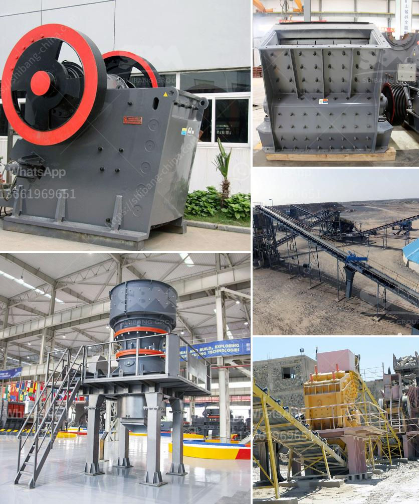

<h3>gypsum bord plant factorie price</h3>
Gypsum board, also known as drywall or plasterboard, is a widely used construction material for interior walls and ceilings. Gypsum boards are made from a mineral called gypsum, which is a naturally occurring sedimentary rock. These boards provide a smooth and flat surface that is easy to paint and decorate, making them a popular choice in residential and commercial buildings.

One crucial factor that affects the price of gypsum board is the location of the manufacturing plant. Construction materials, including gypsum board, are heavy and expensive to transport over long distances. Therefore, having a gypsum board plant near the construction site can significantly reduce transportation costs, resulting in a lower overall price for the product.

Another factor influencing the price of gypsum board is the size and capacity of the manufacturing plant. Larger plants with higher production capacity usually benefit from economies of scale, allowing them to produce gypsum boards at a lower cost per unit. As a result, these plants can offer more competitive prices to their customers.

Furthermore, technological advancements play a role in determining the price of gypsum board. Modern manufacturing plants often incorporate advanced technologies that streamline the production process, reduce waste, and enhance efficiency. These technologies can help manufacturers lower their production costs, which can be passed on to customers in the form of lower prices.

In addition to the plant location, capacity, and technology, the availability of raw materials is another crucial factor affecting gypsum board prices. Gypsum, the primary raw material used in manufacturing gypsum board, can vary in quality and accessibility depending on the location. Areas with abundant gypsum deposits tend to have lower production costs, resulting in more affordable gypsum board prices.

Labor costs also impact the price of gypsum board. Countries with lower labor costs can produce gypsum boards at a lower price compared to those with higher labor costs. Therefore, gypsum board plants located in regions with lower labor costs can offer more competitive prices to consumers.

Market competition is another force that influences gypsum board prices. When there are multiple manufacturers competing for the same market, price competition arises. This often leads to lower prices as manufacturers strive to attract customers. Conversely, limited competition can lead to higher prices as manufacturers have less incentive to offer competitive rates.

It is important to note that while price is a significant consideration, other factors should also be taken into account when choosing a gypsum board supplier. Key factors to consider include product quality, customer service, technical support, and delivery capabilities.

In conclusion, the price of gypsum board from plant factories is influenced by various factors. These include the location and proximity to the construction site, plant size and capacity, technological advancements, availability of raw materials, labor costs, and market competition. Considering these factors can help consumers make an informed decision when purchasing gypsum board for their construction projects.
<h3>Contact us</h3><ul><li><strong>Whatsapp:&nbsp;<a href="https://wa.me/8613661969651">+8613661969651</a></strong></li><li><a href="https://swt.shibang-china.com/?git&amp;zhl&amp;gypsum bord plant factorie price"><strong>Online Service(chat now)</strong></a></li></ul><h3>Related</h3><ul><li><a href='small scale tantalum milling machine supplier.md'>small scale tantalum milling machine supplier</a></li><li><a href='gravel making crusher.md'>gravel making crusher</a></li><li><a href='mobile crushers manufactureres in china.md'>mobile crushers manufactureres in china</a></li><li><a href='usine carbonate de calcium.md'>usine carbonate de calcium</a></li><li><a href='clay making process nigeria.md'>clay making process nigeria</a></li></ul>