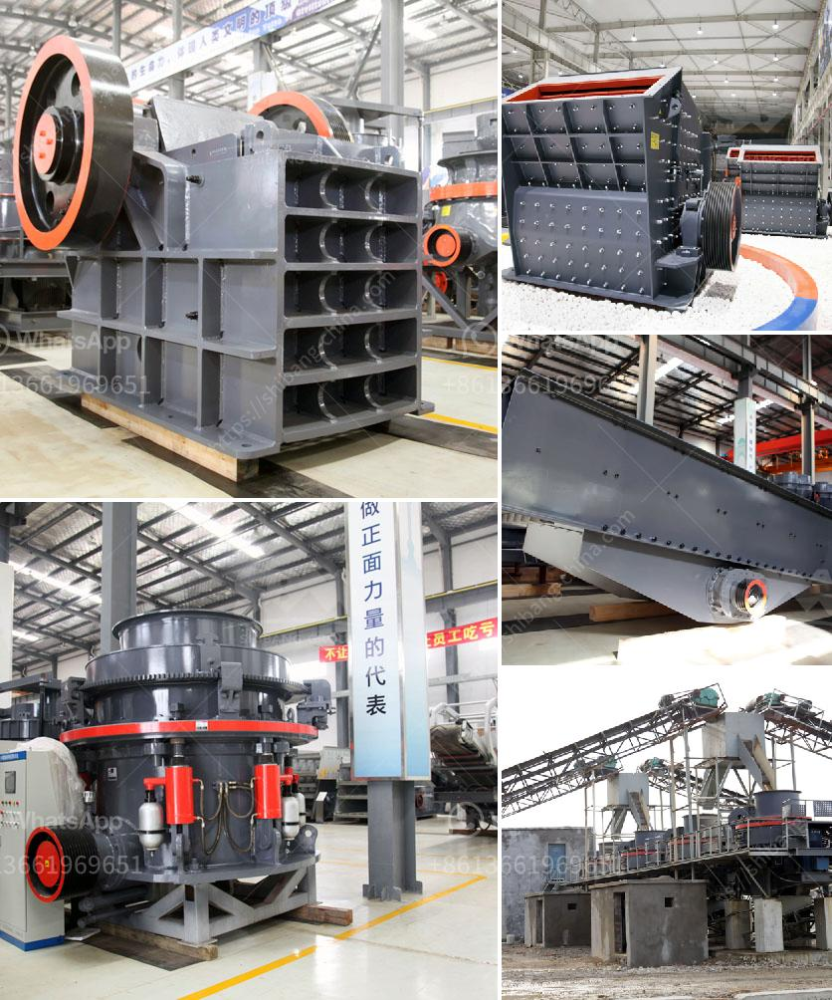

<h3>gypsum crushing plant</h3>
Gypsum is a common mineral found in many places around the world. The majority of gypsum is derived from open-pit quarries. It is usually white or grey in color, but can also be found in shades of yellow, brown, or pink. Gypsum has been used for thousands of years for various purposes, including construction, agriculture, and industry.

One of the most important uses of gypsum is in the construction industry. Gypsum is a key ingredient in plaster, which is used to make drywall, ceiling tiles, and other building materials. In order to produce high-quality gypsum products, the raw material must be crushed to a smaller size before being used in construction.

A gypsum crushing plant can be adapted to a variety of configurations. Crushing equipment commonly used in gypsum handling includes jaw crushers, impact crushers, roller crushers, hammer crushers, and screens. These types of crushers can be used alone or in combination with other crushers to produce the desired product size.

The gypsum crushing plant we provide has advanced technology, reliable operation, and easy maintenance. The centralized control system ensures the equipment is well maintained and operates at peak efficiency. The plant is equipped with dust removal equipment to minimize dust emissions and create a cleaner working environment.

The gypsum crushing plant is designed with a vibrating feeder for smooth and consistent material flow. The impact crusher uses striking to break down large pieces of gypsum into smaller particles. The final crushed material is screened using a variety of screens to ensure the desired size is achieved. The oversize material is then returned to the impact crusher for further crushing.

The crushed gypsum is stored in a bin before being transported to the grinding mill for further processing. The grinding mill ensures the gypsum is finely ground into a powder that can be used for various purposes. The grinding process is controlled to produce the desired particle size and minimize energy consumption.

In addition to its use in construction, gypsum also has many other applications. It is used in agriculture to improve soil structure and supply essential nutrients to plants. Gypsum is also used in industry for a variety of purposes, such as in the manufacturing of cement, paper, and paint.

Overall, a gypsum crushing plant plays a crucial role in the production of high-quality gypsum products. It ensures the raw material is efficiently crushed and processed to meet the required specifications. The plant is designed with advanced technology and equipment to ensure reliable operation and easy maintenance. With the increasing demand for gypsum products, a well-designed and efficient gypsum crushing plant is essential for the success of any gypsum production operation.
<h3>Contact us</h3><ul><li><strong>Whatsapp:&nbsp;<a href="https://wa.me/8613661969651">+8613661969651</a></strong></li><li><a href="https://swt.shibang-china.com/?git&amp;zhl&amp;gypsum crushing plant"><strong>Online Service(chat now)</strong></a></li></ul><h3>Related</h3><ul><li><a href='stone crushers turkey.md'>stone crushers turkey</a></li><li><a href='jaw crushers impact.md'>jaw crushers impact</a></li><li><a href='how much cost to buildton cement plant.md'>how much cost to buildton cement plant</a></li><li><a href='crusher in antioquia stone crusher.md'>crusher in antioquia stone crusher</a></li><li><a href='mobile concrete crusher uk prices.md'>mobile concrete crusher uk prices</a></li></ul>