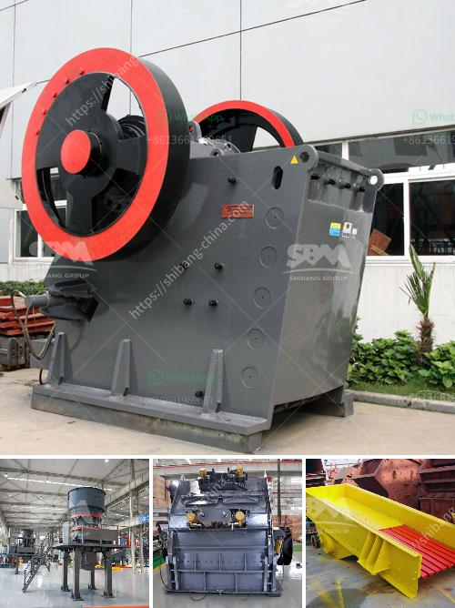

<h3>gypsum manufacturer gypsum manufacturers</h3>
Gypsum is a mineral widely used in the construction industry for its excellent fire resistance, sound insulation properties, and affordability. Gypsum manufacturers play a crucial role in providing construction materials that meet the highest quality standards. These manufacturers use advanced technologies and techniques to extract, process, and produce gypsum products that cater to various construction needs.

One of the key benefits of working with a gypsum manufacturer is the access to a wide range of gypsum-based construction products. These products include gypsum boards, also known as drywall or plasterboard, which are the most common applications of gypsum in construction. Gypsum boards are widely used as wall or ceiling materials due to their fire-resistant and soundproofing properties.

In addition to gypsum boards, manufacturers produce gypsum plasters, commonly known as plaster of Paris, which are extensively used for decorative purposes, as well as for creating intricate designs and sculptures. Gypsum plasters provide a smooth and durable surface, making them ideal for interior walls and ceilings.

Another common gypsum product is gypsum blocks, which are used in the construction of partitions and load-bearing walls. Gypsum blocks offer excellent stability, durability, and sound insulation properties, making them an ideal choice for both residential and commercial buildings.

Gypsum manufacturers ensure that their products meet the required industry standards and regulations. The manufacturing process involves carefully selecting top-quality raw gypsum, which is then processed to remove impurities and enhance its properties. The extracted gypsum is crushed into a fine powder and mixed with additives to improve its setting time, strength, and other characteristics. The resulting mixture is then shaped into boards, blocks, or other desired forms.

Gypsum manufacturers also focus on sustainable practices and environmental responsibility. They aim to minimize waste, energy consumption, and emissions by adopting eco-friendly manufacturing techniques. Many manufacturers are committed to recycling waste gypsum products and reducing their carbon footprint. By utilizing sustainable practices, these manufacturers contribute to a greener and more sustainable construction industry.

When choosing a gypsum manufacturer, it is essential to consider their reputation, experience, and commitment to quality. Reputable manufacturers prioritize customer satisfaction and offer reliable technical support and assistance to help customers in selecting the right gypsum product for their specific requirements. They also ensure prompt delivery and offer competitive pricing, making them a preferred choice for contractors and builders.

In conclusion, gypsum manufacturers play a vital role in the construction industry by offering top-quality gypsum products that meet the highest standards. Their extensive range of products, including gypsum boards, plasters, and blocks, provide versatility and reliability in various construction applications. By adopting sustainable practices, these manufacturers contribute to a greener and more environmentally responsible construction industry. When selecting a gypsum manufacturer, it is crucial to consider their reputation, experience, and commitment to quality to ensure the best results for any construction project.
<h3>Contact us</h3><ul><li><strong>Whatsapp:&nbsp;<a href="https://wa.me/8613661969651">+8613661969651</a></strong></li><li><a href="https://swt.shibang-china.com/?git&amp;zhl&amp;gypsum manufacturer gypsum manufacturers"><strong>Online Service(chat now)</strong></a></li></ul><h3>Related</h3><ul><li><a href='proposal pabrik stone crusher.md'>proposal pabrik stone crusher</a></li><li><a href='hydraulic concrete crusher.md'>hydraulic concrete crusher</a></li><li><a href='komatsu br200 mobile crushers for sale.md'>komatsu br200 mobile crushers for sale</a></li><li><a href='induatrial mill crusher supplier.md'>induatrial mill crusher supplier</a></li><li><a href='fly ash crusher unit india.md'>fly ash crusher unit india</a></li></ul>