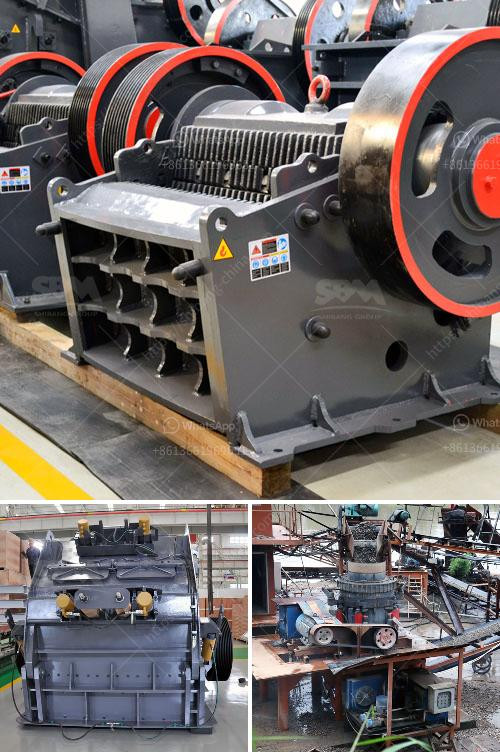

<h3>gypsum mining companies in kenya</h3>
Gypsum is a mineral found in abundant deposits worldwide. It is primarily extracted from large-scale open-pit mines. The demand for gypsum is steadily increasing as it is primarily used in the construction industry for wallboard and plaster. Kenya is not an exception when it comes to gypsum mining. With its strategically positioned gypsum deposits, gypsum mining companies in Kenya are able to capitalize on this abundant mineral resource.

Gypsum mining companies in Kenya have increased their grip on the market for the mineral due to its widespread use. The rising demand has led to intensified mining activities in the country, with several new players entering the market. The major players in the industry are working towards adopting sustainable mining practices to ensure environmental conservation.

One of the leading gypsum mining companies in Kenya is Magadi Gypsum. It operates in the Kajiado region of the country. The company uses open-cast mining methods to extract the gypsum deposits. Additionally, they also produce agricultural gypsum, which is used to improve soil fertility in farming.

Another prominent player in the industry is Erdemann Gypsum. They operate the largest gypsum quarry in Kenya, located in Makueni County. The company produces high-quality gypsum products including plasters, ceiling boards, and cornices.

Other gypsum mining companies in Kenya include El-Wak Gypsum, Knauf Gypsum Kenya, and Deco Dura Creations.

The gypsum mining industry in Kenya is a significant contributor to the country's economy. The mining companies have impacted local communities positively by providing employment opportunities and infrastructure development. However, it is essential for these companies to ensure responsible mining practices by implementing measures to mitigate environmental impacts and safeguard the well-being of the surrounding communities.

In conclusion, gypsum mining companies in Kenya are an integral part of the construction industry. With the increasing demand for gypsum, these companies are playing a vital role in meeting the market needs. The industry has the potential to drive economic growth and development in Kenya while ensuring sustainable mining practices.
<h3>Contact us</h3><ul><li><strong>Whatsapp:&nbsp;<a href="https://wa.me/8613661969651">+8613661969651</a></strong></li><li><a href="https://swt.shibang-china.com/?git&amp;zhl&amp;gypsum mining companies in kenya"><strong>Online Service(chat now)</strong></a></li></ul><h3>Related</h3><ul><li><a href='concrete crushing testing equipment.md'>concrete crushing testing equipment</a></li><li><a href='india stone crusher in bangladesh.md'>india stone crusher in bangladesh</a></li><li><a href='coal crusher buyer in philippines.md'>coal crusher buyer in philippines</a></li><li><a href='gold mining equipment manufacturer.md'>gold mining equipment manufacturer</a></li><li><a href='roller mill suppliers in mexico.md'>roller mill suppliers in mexico</a></li></ul>