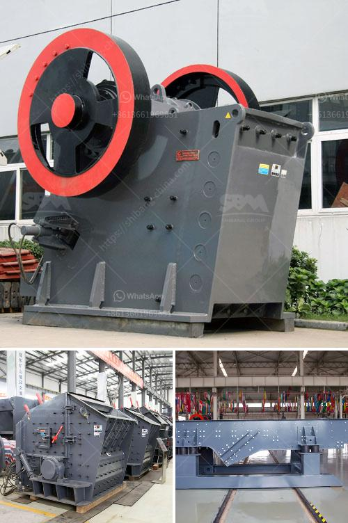

<h3>gypsum plant equipment catalogue</h3>
Gypsum is a versatile material that has numerous applications in industries such as construction, agriculture, and medicine. Its demand has been on the rise due to its beneficial properties, including fire resistance, sound insulation, and soil conditioning. To meet this increasing demand, gypsum plants require efficient and reliable equipment to maximize productivity while ensuring consistent quality.

A gypsum plant equipment catalogue serves as a comprehensive guide for gypsum plant owners and operators, providing valuable information about the machinery and tools needed to carry out various production processes. This catalogue includes descriptions, specifications, and technical details for each piece of equipment, allowing plant owners to make informed decisions regarding their equipment purchases.

1. Crushers: Gypsum rocks need to be crushed into smaller pieces before further processing. Crushers, available in different sizes and capacities, are used for this purpose.

2. Grinding mills: Gypsum is ground to specific particle sizes to meet various application requirements. Grinding mills use rotating discs or rollers to crush and grind gypsum, ensuring a consistent and fine powder.

3. Kilns: In gypsum plants, kilns are used to heat the gypsum powder, forming a product known as calcined gypsum or plaster of Paris. These kilns operate at high temperatures to convert raw gypsum into a usable form.

4. Drying equipment: After the kiln process, gypsum may still contain some moisture. Drying equipment such as rotary dryers or fluidized bed dryers removes this moisture, making the gypsum suitable for storage and further handling.

5. Conveyors: Gypsum needs to be transported between different stages of the production process. Conveyors allow for efficient and seamless movement of gypsum, reducing manual handling and improving overall productivity.

Investing in high-quality and reliable equipment from reputable manufacturers is crucial for long-term success in the gypsum industry. A well-designed gypsum plant equipment catalogue presents various options to choose from, taking into account different plant sizes, production capacities, and budget considerations.

Furthermore, a comprehensive equipment catalogue also highlights the latest technological advancements in the industry. Plant owners can explore innovative equipment that enhances efficiency, reduces energy consumption, and promotes sustainability.

In conclusion, a gypsum plant equipment catalogue is a valuable resource for any gypsum plant owner or operator. It provides a thorough overview of the essential machinery and tools required for gypsum production, enabling informed decision-making and optimizing plant operations. By investing in reliable and efficient equipment, gypsum plant owners can meet the increasing demand for gypsum products while ensuring consistent quality and maximizing productivity.
<h3>Contact us</h3><ul><li><strong>Whatsapp:&nbsp;<a href="https://wa.me/8613661969651">+8613661969651</a></strong></li><li><a href="https://swt.shibang-china.com/?git&amp;zhl&amp;gypsum plant equipment catalogue"><strong>Online Service(chat now)</strong></a></li></ul><h3>Related</h3><ul><li><a href='what is the best granite crusher machine.md'>what is the best granite crusher machine</a></li><li><a href='bauxite ore processing plant for sale.md'>bauxite ore processing plant for sale</a></li><li><a href='fly ash crusher unit india.md'>fly ash crusher unit india</a></li><li><a href='sand making machine zenith.md'>sand making machine zenith</a></li><li><a href='purchase of stone crusher.md'>purchase of stone crusher</a></li></ul>