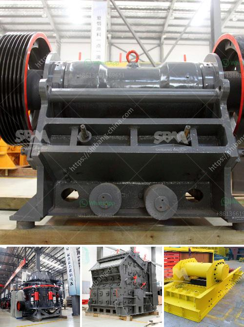

<h3>gypsum powder grinding mill price in pakistan</h3>
Gypsum is a type of mineral that is commonly used in the manufacturing of building materials such as cement, plaster, and drywall. These minerals are abundantly available in Pakistan, and gypsum powder is widely used in many industries. This is the reason why gypsum powder grinding mill price in Pakistan is more expensive than the prices in other countries.

Gypsum powder demand is increasing year by year. This is because gypsum is a reliable and environment-friendly raw material for construction. Its fire resistance and soundproofing properties also make it a preferred choice for building materials. As a result, there is a huge demand for gypsum powder grinding mills in Pakistan, especially in areas where construction projects are booming.

The gypsum powder grinding mill is widely used in metal and non-metal mines. Major manufacturers of gypsum powder grinding mills include Shanghai Clirik Machinery Co., Ltd and Hengda Mill. Gypsum is a common, soft, and sulfate mineral. It is mainly used to make cement, chemical, and construction industry. The annual price of gypsum powder is between $600 and $700 per ton, according to the statistics of the World Bank.

Pakistan has rich gypsum deposits, with several gypsum processing plants operating in different parts of the country. In 2019, Pakistan exported around 39 thousand tons of gypsum to India and the United Arab Emirates. The overall value of gypsum exports in Pakistan stood at $1.4 million. However, gypsum powder grinding mills are not only suitable for the mining industry but also used in cement, chemical, and construction industries.

Gypsum powder grinding mill price in Pakistan is no doubt competitive, and it attracts many customers from different countries who need grinding mill for gypsum powder. As a professional mining equipment manufacturer and supplier, Shanghai Clirik Machinery Co. Ltd can provide you with high-quality machines with competitive prices.

The new mill developed by Clirik has high equipment performance and energy-saving and environmental protection. It has stable performance, large capacity, and low energy consumption. According to the customer's production needs, we can customize the exclusive selection and configuration plan to help customers achieve greater value.

In conclusion, gypsum powder grinding mill is a profitable and environment-friendly milling machine suitable for gypsum processing. With the increasing global demand for gypsum powder, the prices of gypsum powder grinding mills in Pakistan will continue to rise, and our company strives to provide customers with high-quality grinding mills at reasonable prices. Whether you are a new customer or an old friend, please feel free to consult us for further information and details. We are always ready to serve you.
<h3>Contact us</h3><ul><li><strong>Whatsapp:&nbsp;<a href="https://wa.me/8613661969651">+8613661969651</a></strong></li><li><a href="https://swt.shibang-china.com/?git&amp;zhl&amp;gypsum powder grinding mill price in pakistan"><strong>Online Service(chat now)</strong></a></li></ul><h3>Related</h3><ul><li><a href='mini cement plant project report.md'>mini cement plant project report</a></li><li><a href='conveyor belts in malaysia.md'>conveyor belts in malaysia</a></li><li><a href='impact crusher for sale saudi.md'>impact crusher for sale saudi</a></li><li><a href='stone quarry machine manufacturers.md'>stone quarry machine manufacturers</a></li><li><a href='stone hammer mill machine.md'>stone hammer mill machine</a></li></ul>