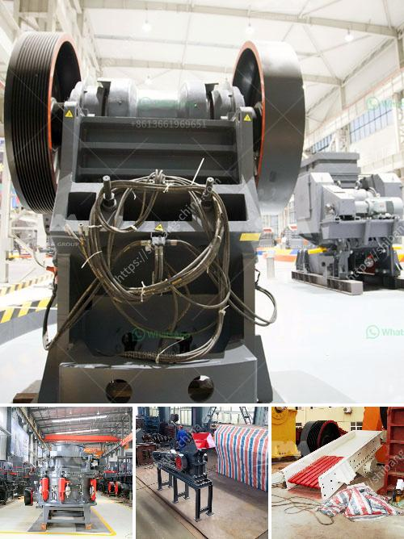

<h3>gypsum powder production process pdf</h3>
Gypsum powder is a white, smooth powder that is derived from heating gypsum stone. Mined gypsum is crushed, heat-dried, and then cooled, resulting in an odorless, fine powder known as gypsum powder. In this article, we will explore the gypsum powder production process in detail.

The gypsum powder production process begins with the extraction of gypsum ore from underground mines. The ore is then crushed into small pieces and finely ground to a powder. A rotary kiln is used to heat the gypsum at high temperatures, which removes any remaining water molecules and produces a dry, fine powder known as raw gypsum.

To enhance its properties, various additives like water-reducing agents, accelerators, and retarders can be added to the raw gypsum powder during the grinding process. These additives influence the setting time, strength development, and workability of the final product.

After grinding, the fine powder is transported to a calcination chamber, where it is heated at temperatures above 100°C. This process, known as calcination, drives off the remaining water molecules and converts the raw gypsum into a unique plaster. The gypsum plaster obtained is further ground into a finer powder known as plaster of Paris.

The plaster of Paris is then packaged and distributed to different industries. It is widely used in construction, art, and medical applications. In construction, gypsum powder is used to make plasterboards, decorative cornices, and molds for casting.

In conclusion, the process of gypsum powder production involves extracting gypsum ore, crushing, grinding, and calcination of the raw material, and then producing the powder. This powder is widely used in various industries, including construction and medical applications. The production process has several steps, all of which contribute to the final quality and properties of gypsum powder.
<h3>Contact us</h3><ul><li><strong>Whatsapp:&nbsp;<a href="https://wa.me/8613661969651">+8613661969651</a></strong></li><li><a href="https://swt.shibang-china.com/?git&amp;zhl&amp;gypsum powder production process pdf"><strong>Online Service(chat now)</strong></a></li></ul><h3>Related</h3><ul><li><a href='ball mill manufacturers in india.md'>ball mill manufacturers in india</a></li><li><a href='rock crushing plants for sale.md'>rock crushing plants for sale</a></li><li><a href='crushing companies in the usa.md'>crushing companies in the usa</a></li><li><a href='quarry equipment manufacturers.md'>quarry equipment manufacturers</a></li><li><a href='aggregates crusher plants in malaysia.md'>aggregates crusher plants in malaysia</a></li></ul>