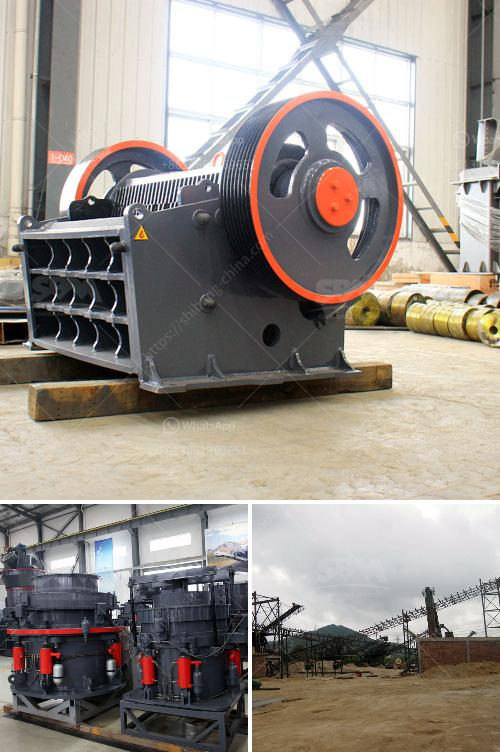

<h3>gypsum processing machines</h3>
Gypsum is a versatile and essential material in many industries. From construction to healthcare, gypsum is used in various applications due to its unique properties. To process gypsum efficiently and effectively, specialized gypsum processing machines are used. These machines play a vital role in transforming raw gypsum into high-quality products. In this article, we will explore the different types of gypsum processing machines and their importance in the gypsum processing industry.

One of the most common gypsum processing machines is the gypsum grinding mill. This machine grinds gypsum rocks or lumps into smaller particles. The ground gypsum is then heated in high-temperature kilns to remove any remaining moisture and convert it into a fine powder known as plaster of Paris. The gypsum grinding mill is essential in achieving the desired fineness and quality of the final product.

Another important gypsum processing machine is the gypsum calciner. This machine is used to heat the ground gypsum powder to a specific temperature, typically between 150 to 200 degrees Celsius. During this process, the water in the gypsum evaporates, and the individual particles fuse together to form a solid mass. The calcined gypsum, also known as stucco, is used in various applications such as plasterboard production, cement manufacturing, and as a soil conditioner.

In addition to grinding mills and calciners, gypsum processing also requires other specialized machines. Gypsum crushers are used to crush large-size gypsum ore into smaller particles. This enables a more efficient grinding process and ensures that the gypsum particles are evenly dispersed throughout the ground gypsum powder.

Gypsum dryers are another crucial machine in the gypsum processing industry. These dryers remove the remaining moisture from the calcined gypsum, allowing it to be stored and transported without any degradation in quality. Gypsum dryers use hot air to evaporate the moisture, resulting in a dried gypsum product with controlled moisture content.

Moreover, gypsum processing machines also include gypsum powder packing machines. These machines are used to package and seal the gypsum powder into bags or containers of different sizes. The packaging process ensures that the gypsum powder remains dry and free-flowing, ready for transportation and use in various applications.

Overall, gypsum processing machines are essential in transforming raw gypsum into valuable products. They play a crucial role in achieving the desired quality and consistency of gypsum-based materials. Without these machines, the gypsum processing industry would struggle to meet the demands of various sectors like construction, agriculture, and healthcare.

In conclusion, gypsum processing machines are integral to the gypsum industry. From grinding mills to calciners, crushers to dryers, and packing machines, each machine serves a specific purpose in the gypsum processing chain. These machines enable efficient processing and ensure the production of high-quality gypsum products. As the demand for gypsum-based materials continues to grow, the importance of these machines in the gypsum processing industry will only increase.
<h3>Contact us</h3><ul><li><strong>Whatsapp:&nbsp;<a href="https://wa.me/8613661969651">+8613661969651</a></strong></li><li><a href="https://swt.shibang-china.com/?git&amp;zhl&amp;gypsum processing machines"><strong>Online Service(chat now)</strong></a></li></ul><h3>Related</h3><ul><li><a href='lm vertical mill.md'>lm vertical mill</a></li><li><a href='chinese gypsum production line equipment.md'>chinese gypsum production line equipment</a></li><li><a href='mobile impact crusher in road construction.md'>mobile impact crusher in road construction</a></li><li><a href='sand mining for construction in equatorial guinea.md'>sand mining for construction in equatorial guinea</a></li><li><a href='balls for mining mill.md'>balls for mining mill</a></li></ul>