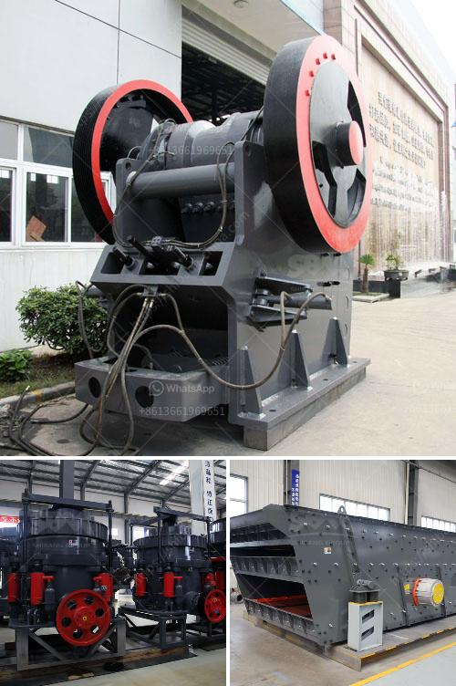

<h3>gypsum stone crusher machine</h3>
Gypsum is a mineral found in crystal as well as masses called gypsum rock. It is a very soft mineral and it can form very pretty, and sometimes extremely large colored crystals. Massive gypsum rock forms within layers of sedimentary rock, typically found in thick beds or layers. It can be purchased from retailers who specialize in rocks and minerals.

Gypsum rock must be excavated from mines or quarries, then crushed and ground into a fine powder. Once gypsum is in a powdered form, it is ready to begin the pelletization process. This process involves mixing the powdered gypsum with water, then pelletizing the mixture. The pellets are comprised of dried and heated rock that is ground down into powder and often used in light construction applications.

Gypsum stone crusher machines are usually used in gypsum mining process, the blockbuster gypsum mine crushing mill produced by our company is a device specially designed for the fine processing of gypsum. It has a series of advantages such as reliable operation, low operating cost, stable operation, and convenient maintenance. It effectively implements the innovation and integration of science and technology.

The gypsum rock crusher uses jaw crusher, cone crusher, impact crusher, vertical impact crusher, etc. to crush gypsum rock into small particles. Then, the crushed gypsum particles are screened for secondary crushing by a circular vibrating screen. The secondary crushing process uses hammer crusher or impact crusher to crush gypsum into smaller particles less than 2 mm.

Jaw crusher is the most popular crushing plant for size reduction of big massive material, impact crusher and cone crusher will also be used for fine crushing. Screening with a sieve will remove large grains which have not been crushed properly and which may contain impurities. Grinding, for example in a ball, rod, or hammer mill, is necessary if the gypsum is to be used for high quality plaster work or for moulding, medical, or industrial applications.

The versatile crusher plant for stone pulverizing highlights low transportation cost, adaptable design, simple support, and so forth. The portable crusher plant can work autonomously, as well as be consolidated with different machines in a creation line. There are for the most part a few sorts of versatile crusher plant, that is jaw portable crusher plant, cone versatile crusher plant, and impact versatile crusher plant.

Gypsum stone crusher machine has gained a good reputation in the market because of its remarkable advantages such as stable performance, high productivity, and low energy consumption. If you want to invest in the gypsum mining industry, gypsum stone crusher machine is necessary to crush the gypsum stone to a specific size. Due to the wide range of applications and the good market of gypsum, worldwide, gypsum is widely used in building materials industry, architecture, ceramics and other fields.

In conclusion, gypsum stone crusher machine is widely used in mine ore mining, construction buiding materials, chemistry industry, suitable for crushing high hard, mid hard and soft rocks and ores such as iron ore, limestone, slag, marble, quartz, granite, cement, clinker, coal, and so on.
<h3>Contact us</h3><ul><li><strong>Whatsapp:&nbsp;<a href="https://wa.me/8613661969651">+8613661969651</a></strong></li><li><a href="https://swt.shibang-china.com/?git&amp;zhl&amp;gypsum stone crusher machine"><strong>Online Service(chat now)</strong></a></li></ul><h3>Related</h3><ul><li><a href='activated carbon plant business plan.md'>activated carbon plant business plan</a></li><li><a href='roller screen for coal.md'>roller screen for coal</a></li><li><a href='quartz crushing plant for engineered stone.md'>quartz crushing plant for engineered stone</a></li><li><a href='mobile gold processing plant south africa.md'>mobile gold processing plant south africa</a></li><li><a href='stone crushers in uttarakhand.md'>stone crushers in uttarakhand</a></li></ul>