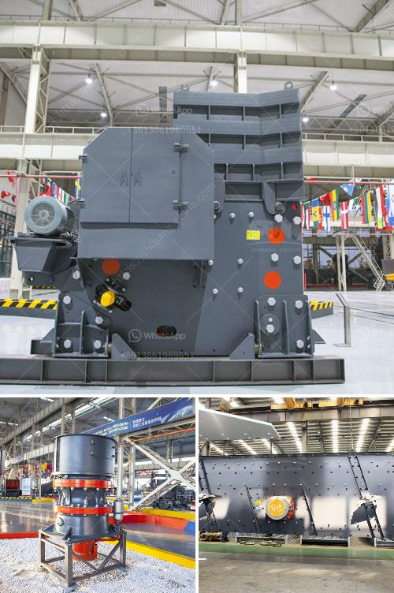

<h3>gypsum vibrating screen</h3>
Gypsum is a widely used material in construction projects due to its excellent fire resistance and sound insulation properties. It is a natural mineral that is processed into a fine powder and mixed with water to form a paste that can be molded into various shapes.

One of the essential steps in gypsum processing is screening the powder to remove any impurities or oversized particles. This is where a gypsum vibrating screen comes into play. This specialized equipment is designed to separate the gypsum powder into different particle sizes, ensuring a quality product.

The gypsum vibrating screen operates on the principle of gyratory motion, utilizing a low-powered motor to drive the screen. It uses a combination of motion and airflow to separate the particles efficiently. The screen is composed of multiple layers of mesh, with each layer having different-sized openings to allow the desired particle size to pass through.

The vibrating motion of the screen helps to break down any clumps or aggregates, ensuring a consistent particle size distribution. It also helps to remove any materials that may have adhered to the gypsum particles during processing. The airflow created by the vibrating screen assists in carrying away the lightweight particles, further enhancing the screening efficiency.

A gypsum vibrating screen is typically equipped with various features to optimize its performance. These may include adjustable vibrating amplitude, frequency, and angle of inclination. These settings can be customized based on the specific requirements of the gypsum processing plant, helping to achieve the desired product specifications.

In conclusion, a gypsum vibrating screen is a crucial piece of equipment in the gypsum processing industry. It ensures the production of high-quality gypsum powder by efficiently separating the particles and removing impurities. By investing in a reliable and efficient vibrating screen, gypsum manufacturers can enhance their production capabilities and deliver superior products to their customers.
<h3>Contact us</h3><ul><li><strong>Whatsapp:&nbsp;<a href="https://wa.me/8613661969651">+8613661969651</a></strong></li><li><a href="https://swt.shibang-china.com/?git&amp;zhl&amp;gypsum vibrating screen"><strong>Online Service(chat now)</strong></a></li></ul><h3>Related</h3><ul><li><a href='graphite crusher products.md'>graphite crusher products</a></li><li><a href='wet grinding ball mills china.md'>wet grinding ball mills china</a></li><li><a href='stone crusher machine supplier.md'>stone crusher machine supplier</a></li><li><a href='cement plant operations handbook.md'>cement plant operations handbook</a></li><li><a href='used in vibrating screens.md'>used in vibrating screens</a></li></ul>