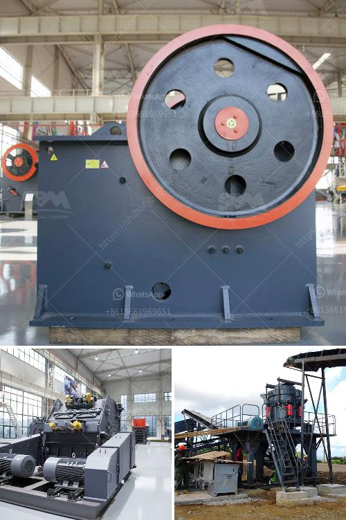

<h3>gypsum washing equipment for sale</h3>
Gypsum is a mineral commonly found in sedimentary formations and can be used in a wide variety of applications. One of the most common uses of gypsum is for making drywall and plaster products. To achieve the desired quality and consistency, gypsum needs to be properly processed and washed before it can be used in these applications. This is where gypsum washing equipment comes in.

Gypsum washing equipment is used to wash gypsum residues from gravel, sandy soils, or rock. It helps to remove impurities and obtain a more refined and high-quality gypsum product. Gypsum washing equipment typically includes crushers, screens, hydrocyclones, attrition scrubbers, and log washers. These machines work together in a closed-loop system to ensure the thorough cleaning and washing of gypsum materials.

When it comes to purchasing gypsum washing equipment, there are several options available in the market. Buyers can choose between new or used machines depending on their budget and requirements. New equipment is a great option for those who want the latest technology and assurance of quality. However, it generally comes with a higher price tag.

On the other hand, used gypsum washing equipment can be a cost-effective alternative for buyers on a tight budget. While it may not offer the same level of performance as new machines, it can still deliver satisfactory results when properly maintained. Many reputable suppliers and manufacturers offer used gypsum washing equipment that has been refurbished and tested for optimal functionality.

It is essential to consider the seller's reputation, warranty options, and technical support when purchasing gypsum washing equipment, whether new or used. Industry-leading manufacturers often provide training, spare parts, and maintenance support to ensure the smooth operation of their machines.

In conclusion, gypsum washing equipment plays a crucial role in achieving high-quality gypsum products. Whether buyers choose new or used machines, they should always consider the seller's reputation and after-sales support. With proper investment and care, gypsum washing equipment can help businesses enhance their production capabilities and deliver top-notch gypsum products to the market.
<h3>Contact us</h3><ul><li><strong>Whatsapp:&nbsp;<a href="https://wa.me/8613661969651">+8613661969651</a></strong></li><li><a href="https://swt.shibang-china.com/?git&amp;zhl&amp;gypsum washing equipment for sale"><strong>Online Service(chat now)</strong></a></li></ul><h3>Related</h3><ul><li><a href='stone crushing equipment available in northern cape.md'>stone crushing equipment available in northern cape</a></li><li><a href='project report of lime processing unit.md'>project report of lime processing unit</a></li><li><a href='limestone stone making plant.md'>limestone stone making plant</a></li><li><a href='cost of a silica crusher.md'>cost of a silica crusher</a></li><li><a href='gravel cone crusher for sale.md'>gravel cone crusher for sale</a></li></ul>