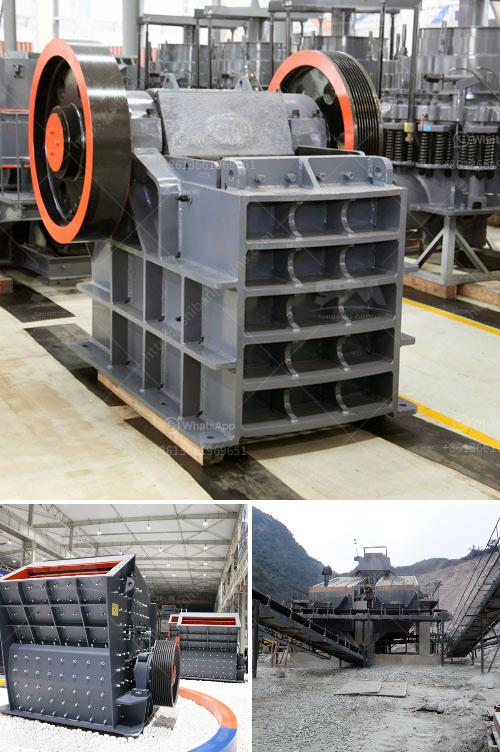

<h3>gyratory crusher copper mine</h3>
A gyratory crusher is a type of crusher which is designed for crushing materials such as copper mines in the mining industry. It works on the principle of an oscillating shaft which is suspended at the top and driven at the bottom with a eccentric mechanism.

Gyratory crushers are used for primary crushing of various materials in various industries such as mining, construction, and chemical processing. The main function of the gyratory crusher is to perform large-scale crushing operations in large mining projects. The gyratory crusher is capable of handling thousands of tons of ore per hour, which makes it the primary crusher for large-scale copper mines.

Copper mines are medium to large-sized mines with a deposit of copper ore that can be extracted economically. Copper mines are used to extract copper from copper ore and refine it into pure copper, which is used in various applications such as electrical wiring, plumbing, and electronics.

The gyratory crusher is one of the main components of the copper mine processing plant. It not only has a large crushing ratio, but also a high processing capacity, which greatly improves the efficiency of copper ore crushing. The gyratory crusher can handle larger ore sizes than conventional jaw crushers, which increases the productivity of the entire production line.

In addition, the gyratory crusher has a unique design with a steep crushing chamber and a long crushing surface, which allows the crusher to process more ore at a time. This reduces the need for multiple crushers and optimizes the use of mining equipment, saving both time and money for the copper mine.

Overall, the gyratory crusher is an essential equipment in the copper mine processing plant. Its high efficiency and large processing capacity make it a crucial component in the copper mining industry. With the increasing demand for copper worldwide, gyratory crushers play a vital role in meeting the needs of the mining industry.
<h3>Contact us</h3><ul><li><strong>Whatsapp:&nbsp;<a href="https://wa.me/8613661969651">+8613661969651</a></strong></li><li><a href="https://swt.shibang-china.com/?git&amp;zhl&amp;gyratory crusher copper mine"><strong>Online Service(chat now)</strong></a></li></ul><h3>Related</h3><ul><li><a href='mill ball grinding ball mills.md'>mill ball grinding ball mills</a></li><li><a href='limestone processing equipment.md'>limestone processing equipment</a></li><li><a href='small scale mining equipment in nigeria.md'>small scale mining equipment in nigeria</a></li><li><a href='china clay washing equipment for sale.md'>china clay washing equipment for sale</a></li><li><a href='ball mill grinding china.md'>ball mill grinding china</a></li></ul>