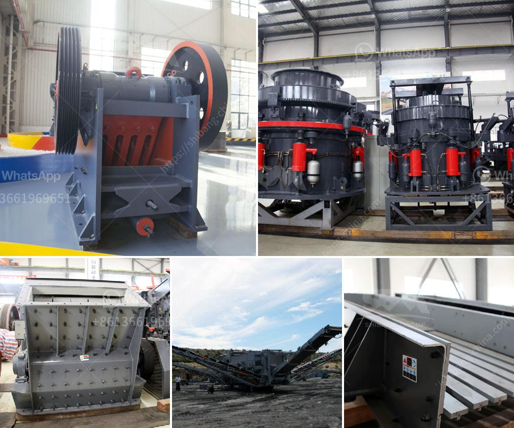

<h3>gyratory crusher harga</h3>
Gyratory crushers are a type of ore processing machine that crushes materials with a high level of compression. It is a relatively newer type of crusher that has been introduced to the mining industry. The crusher machine uses a shaft and a cone to perform the crushing operation. It utilizes the gyratory motion of the crushing cone in a circular chamber to squeeze the rocks and reduce their size.

One of the key advantages of a gyratory crusher is its ability to handle viscous materials with ease. These crushers are designed to handle high-viscosity materials, such as clay or wet ore, which can cause problems in other types of crushers. The gyratory motion allows the crusher to constantly draw in and crush these materials, ensuring efficient and effective processing.

Another advantage of a gyratory crusher is its large feed opening. This means that it can accept larger-sized rocks, reducing the need for secondary crushers. The larger feed opening also allows for a higher throughput, meaning that more material can be processed in a shorter period of time. This is particularly beneficial in large-scale mining operations where efficiency and productivity are vital.

In terms of pricing, gyratory crushers tend to be more expensive than other types of crushers. This is due to their advanced design and the use of high-quality materials. However, the benefits they provide, such as higher throughput and the ability to handle viscous materials, often justify the higher cost.

When considering the harga, or price, of a gyratory crusher, several factors need to be taken into account. These include the size and capacity of the crusher, the materials it is designed to handle, and the manufacturer's reputation. Additionally, the level of after-sales service provided by the manufacturer should also be considered.

It is essential to choose a reputable manufacturer when purchasing a gyratory crusher to ensure the quality and reliability of the equipment. Good manufacturers offer comprehensive customer support, including installation, maintenance, and spare parts availability. Additionally, they provide a warranty, which can give buyers peace of mind.

The harga of a gyratory crusher can vary depending on the specific requirements and preferences of the buyer. It is recommended to contact multiple manufacturers and request quotations to compare prices and determine the best value for money.

In conclusion, gyratory crushers are a valuable tool in the mining industry for their ability to handle viscous materials and high throughput. While they may be more expensive than other types of crushers, their advantages often justify the higher price. When considering the harga of a gyratory crusher, it is important to consider factors such as size, capacity, materials, and after-sales service. Comparing prices from different manufacturers can help buyers make an informed decision and find the best value for their investment.
<h3>Contact us</h3><ul><li><strong>Whatsapp:&nbsp;<a href="https://wa.me/8613661969651">+8613661969651</a></strong></li><li><a href="https://swt.shibang-china.com/?git&amp;zhl&amp;gyratory crusher harga"><strong>Online Service(chat now)</strong></a></li></ul><h3>Related</h3><ul><li><a href='portable hydraulic rock crusher.md'>portable hydraulic rock crusher</a></li><li><a href='aggregate production equipment.md'>aggregate production equipment</a></li><li><a href='market analysis of stone crusher.md'>market analysis of stone crusher</a></li><li><a href='mini ball mill crusher.md'>mini ball mill crusher</a></li><li><a href='project cost of stone crusher of 100 tph.md'>project cost of stone crusher of 100 tph</a></li></ul>