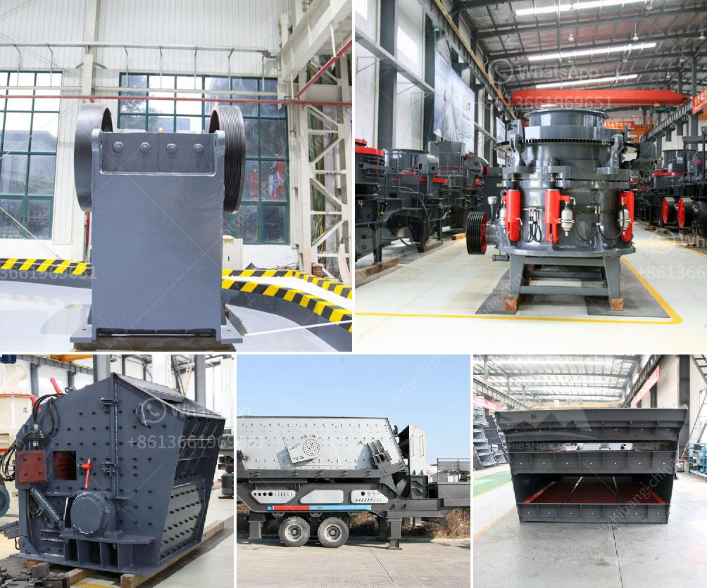

<h3>gyratory crusher second tier concaves</h3>
A gyratory crusher is a mining or ore processing machine that crushes feed material between an eccentrically mounted cone and a fixed crushing throat. Gyratory crushers are the most critical and preferred equipment types for crushing large and hard rocks in mines and ore processing plants. These crushers utilize a gyrating spindle mounted within a concave-shaped chamber to crush material.

While the overall design of gyratory crushers has remained fairly consistent, advancements in technology have led to subtle modifications in their components, optimizing their performance. One such crucial component is the second tier concaves.

The second tier concaves play a vital role in the crushing process, ensuring optimum efficiency and product quality. They are specifically designed to increase the material retention time in the crushing chamber, allowing for better comminution. Due to continuous wear and tear, these concaves need regular inspection, monitoring, and replacement to maintain optimal crushing performance.

There are several factors to consider when selecting the appropriate second tier concaves for a gyratory crusher. These include the material's physical and chemical properties, the anticipated feed size, desired product size, and the crusher's operating conditions. Different types of materials, such as steel or cast iron alloys, may be used to manufacture these concaves, depending on the specific requirements of the application.

The shape and design of the second tier concaves also play a crucial role in the crushing efficiency. Concaves with a flat profile tend to produce a finer product, while ones with a steeper profile yield a coarser output. Manufacturers often offer a range of concave options to cater to different crushing needs. Selecting the appropriate configuration can significantly impact the overall performance of the crusher.

Regular inspection and monitoring of the second tier concaves are critical to ensure proper functioning. Wear patterns on the concave surface indicate their condition. Monitoring the wear rate enables proactive maintenance planning, avoiding unscheduled downtime and excessive operational costs.

Replacing the second tier concaves should be part of routine maintenance. Operating a crusher with worn-out or damaged concaves can lead to reduced efficiency, increased power consumption, and even premature component failure. Timely replacement, based on wear patterns and manufacturer recommendations, ensures consistent crushing performance and prolongs the lifespan of the crusher.

Additionally, advancements in technology have introduced innovative options for second tier concaves. Some manufacturers offer concaves with replaceable inserts, allowing for cost-effective maintenance and increased flexibility. These inserts can be replaced separately, minimizing downtime and reducing overall maintenance costs.

In conclusion, gyratory crusher second tier concaves are a crucial component for optimal crushing efficiency. Their design, material, shape, and wear conditions dictate their performance, impacting the quality and yield of the final product. Routine inspection, monitoring, and timely replacement of these concaves are essential for maintaining the crusher's performance and extending its operational lifespan. Investing in high-quality, properly matched concaves is vital for efficient and reliable crushing in mining and ore processing operations.
<h3>Contact us</h3><ul><li><strong>Whatsapp:&nbsp;<a href="https://wa.me/8613661969651">+8613661969651</a></strong></li><li><a href="https://swt.shibang-china.com/?git&amp;zhl&amp;gyratory crusher second tier concaves"><strong>Online Service(chat now)</strong></a></li></ul><h3>Related</h3><ul><li><a href='vertical ball mill technology.md'>vertical ball mill technology</a></li><li><a href='crusher plant sale.md'>crusher plant sale</a></li><li><a href='cement plant machinery supplier in korea.md'>cement plant machinery supplier in korea</a></li><li><a href='price of stone crusher capacity 200 tons per hour.md'>price of stone crusher capacity 200 tons per hour</a></li><li><a href='caco grinding grinder.md'>caco grinding grinder</a></li></ul>