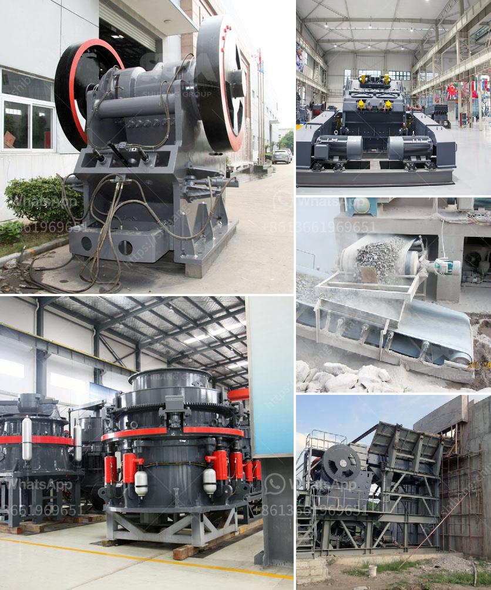

<h3>hammer crusher birotor</h3>
The mining and construction industries are continually evolving, demanding advanced machinery that can handle the toughest materials with ease. In response to this growing need, manufacturers are constantly seeking innovative solutions to enhance their equipment's performance. One such groundbreaking invention is the hammer crusher birotor, a game-changer in the crushing industry.

Traditional hammer crushers have been used for decades to pulverize various materials. While they have proven to be efficient in many applications, they often face limitations when it comes to handling particularly challenging materials. This is where the hammer crusher birotor steps in, offering a more powerful and versatile solution.

The birotor design introduces a second rotor, revolutionizing the hammer crusher's capabilities. By incorporating two rotors instead of one, manufacturers have significantly increased the machine's productivity and efficiency. The dual rotors work in synchronization, allowing for stronger impact forces and better material breakdown.

One of the primary advantages of the birotor design is its ability to handle heterogeneous materials more effectively. Traditional hammer crushers may struggle to process materials with varying densities, sizes, and compositions. However, the birotor hammer crusher excels in this area. The two rotors work together to ensure consistent crushing, allowing for a more homogeneous end product.

Another noteworthy aspect of the hammer crusher birotor is its adaptability to different applications. The dual rotors provide more flexibility, making it possible to adjust the speed and direction of rotation based on the specific material being crushed. This versatility ensures optimal performance in various industries, including mining, construction, and cement production.

Furthermore, the increased power and impact forces generated by the dual rotors enable the birotor hammer crusher to tackle harder and more abrasive materials. This means it can handle a wider range of materials, including rocks, ores, clinker, and coal, without compromising on efficiency or performance. This versatility allows for better utilization of the machine, reducing the need for multiple crushers or additional processing stages.

Additionally, the birotor hammer crusher offers improved reliability and reduced maintenance requirements. The dual rotors distribute the wear evenly, extending the machine's overall lifespan. Moreover, the symmetrical design of the rotors simplifies maintenance tasks and lowers downtime, contributing to higher operational efficiency.

In conclusion, the hammer crusher birotor presents a revolutionary solution for the mining and construction industries. With its dual rotor design, this crushing machine provides enhanced productivity, improved versatility, and increased reliability. It can handle heterogeneous materials more effectively, breaking them down into more homogeneous end products. Furthermore, its adaptability to different applications and ability to crush harder, more abrasive materials make it an invaluable asset in various industries. The birotor hammer crusher is undoubtedly a game-changer, setting new standards in crushing technology and offering manufacturers a competitive edge in the market.
<h3>Contact us</h3><ul><li><strong>Whatsapp:&nbsp;<a href="https://wa.me/8613661969651">+8613661969651</a></strong></li><li><a href="https://swt.shibang-china.com/?git&amp;zhl&amp;hammer crusher birotor"><strong>Online Service(chat now)</strong></a></li></ul><h3>Related</h3><ul><li><a href='mining processing machine supplier companies in pakistan.md'>mining processing machine supplier companies in pakistan</a></li><li><a href='jaw crusher for sale in ethiopia.md'>jaw crusher for sale in ethiopia</a></li><li><a href='europe crusher producers.md'>europe crusher producers</a></li><li><a href='rubber belt conveyor for sale.md'>rubber belt conveyor for sale</a></li><li><a href='barite powder manufacturing plant.md'>barite powder manufacturing plant</a></li></ul>