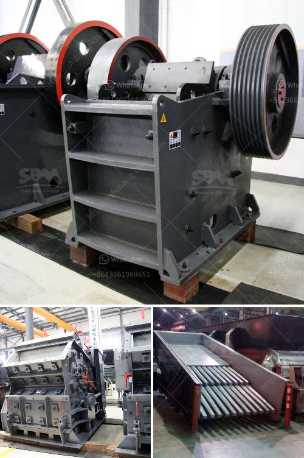

<h3>hammer crusher catalog pdf</h3>
Hammer mills are widely used in mining, smelting, building materials, roads, railways, irrigation, chemistry, and other industries. Hammer crusher catalog pdf is a technical production catalog that showcases all the crusher models that utilize a hammer configuration.

In the hammer mill machine, the motor drives the rotor to rotate at a high speed through the belt, and on the rotor, there are series of hammers. When the materials get into the working area of hammers, the rotating hammers with high rotation speed will crush them, and the crushed products meet the required size can be discharged by the outlet and become the final products.

The hammer crusher catalog pdf includes model, capacity, output size, rotation speed, and weight information to give potential customers an idea of the crusher's suitability for their needs. Additionally, the hammer crusher catalog pdf also highlights detailed description about each machine such as motor power, ranking, overall dimensions, low energy consumption, easy maintenance, and operation while also highlighting any special features or benefits associated with the crusher.

Furthermore, the hammer crusher catalog pdf also illustrates the unique features of different crushers, including some exclusive designs. For instance, the single-stage hammer crusher, the ring hammer crusher, and the heavy hammer crusher all feature different attributes that make them suitable for specific industries and applications.

The single-stage hammer crusher is a heavy hammer crusher with a feeding size of 1100 mm and a production capacity of 200-2200 t/h. It can crush materials of less than 600-1800 mm into 25 mm or less.

The ring hammer crusher is different from the heavy hammer crusher in terms of structure, hammerhead, and rotor. The rotor of the ring hammer crusher consists of a ring hammer suspended on the rotor. The ring hammer revolves along with the rotor in high speed, and the materials are crushed by the collision between the ring hammer and the materials.

The heavy hammer crusher is a new generation crushing machine that is optimized to maximize the advantages of impact crusher, hammer crusher, and counterattack crusher, and to reduce the dust production. The heavy hammer crusher relies on the impact force conveyed by the hammerhead to crush the materials.

In summary, the hammer crusher catalog pdf showcases the wide range of crushers that utilize a hammer configuration. These machines are widely used in various industries, and the catalog provides potential customers with important information about each crusher's capacity, output size, rotation speed, weight, and unique features. Whether it is the single-stage hammer crusher, the ring hammer crusher, or the heavy hammer crusher, there is a suitable option for every customer's specific needs. So, if you are in the market for a hammer mill crusher, this catalog will be a valuable resource for your research.
<h3>Contact us</h3><ul><li><strong>Whatsapp:&nbsp;<a href="https://wa.me/8613661969651">+8613661969651</a></strong></li><li><a href="https://swt.shibang-china.com/?git&amp;zhl&amp;hammer crusher catalog pdf"><strong>Online Service(chat now)</strong></a></li></ul><h3>Related</h3><ul><li><a href='by products of limestone processing.md'>by products of limestone processing</a></li><li><a href='technical features of stone crusher.md'>technical features of stone crusher</a></li><li><a href='harga powerful crusher machine.md'>harga powerful crusher machine</a></li><li><a href='river pebble crusher supplier.md'>river pebble crusher supplier</a></li><li><a href='50tph stone crusher in germany.md'>50tph stone crusher in germany</a></li></ul>