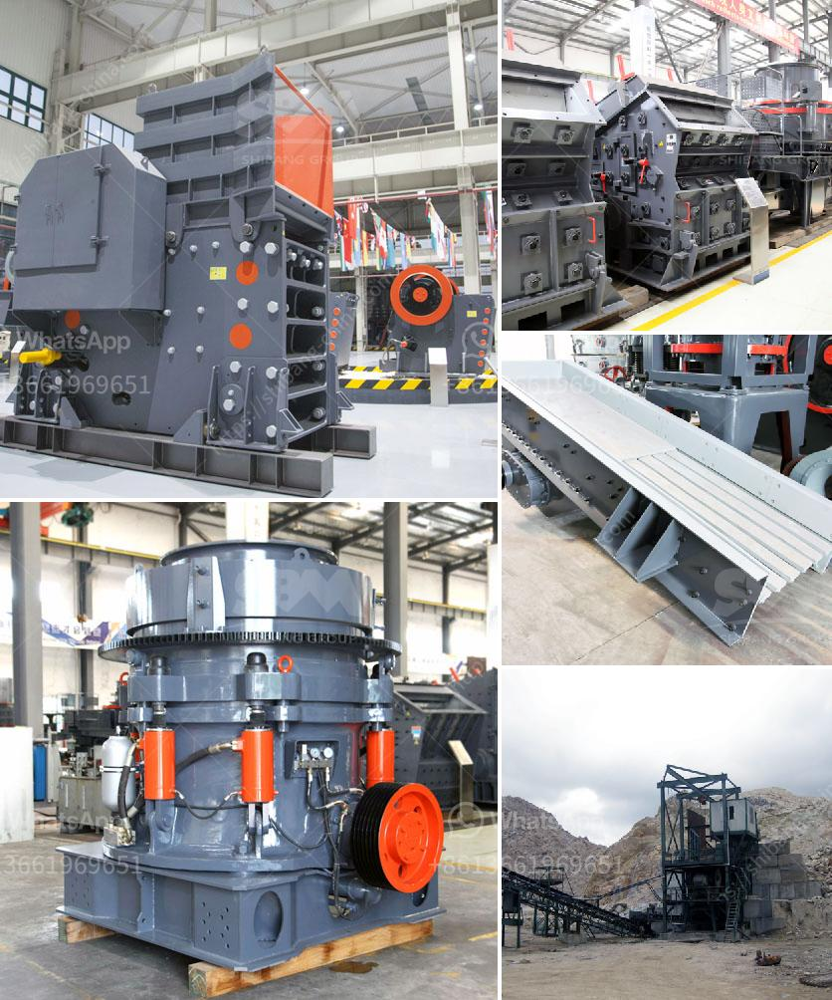

<h3>hammer crusher machine in malaysia</h3>
The hammer crusher machine is widely used in industries such as cement, chemical, electric power, metallurgy and so on. It is used for the medium and fine crushing of materials such as limestone, slag, coke, coal and other materials in the cement kiln and blast furnace. The hammer crusher machine in Malaysia is widely used for medium or fine crushing with medium hard and brittle materials by departments of mine, cement, coal, building material, metallurgy, chemical industry, road construction, gas chemical industry and thermal power generation, etc.

Hammer crusher machine is developed for both dry and wet crushing of brittle, medium-hard materials for the mining, cement, coal, metallurgic materials etc. These materials have the features of high hardness, strong anti-pressure property, and high thermal conductivity and the like. They are used for crushing and grinding purposes in industries like mining, power generation, etc.

Hammer crusher machine in Malaysia can be used not only in crushing production line and sand production line, but also in mineral processing production line, replacing cone crusher. In addition, hammer crusher can be used not only in ore crushing production line, sand production line, but also can be used in mineral processing production line as a more practical and reliable crushing equipment.

Hammer crusher machine is widely applied in mining, building materials, chemical industry, metallurgy, feed and other industries. It can crush materials with medium or less hardness into medium or fine crushing, such as limestone, calcite, talc, gypsum, coal, coke, clay, slag, etc.

With its advantages of high production capacity, stable performance, low energy consumption and convenient maintenance, hammer crusher machine has been widely used in various industrial fields such as cement, chemical industry, electric power, metallurgy and so on.

In conclusion, the hammer crusher machine is a versatile machine that can be used for various applications in Malaysia. With its wide range of functionality, it provides numerous benefits to various industries. Whether it is used in the cement industry or the metallurgical industry, the hammer crusher machine proves to be a reliable crushing equipment capable of tackling various materials efficiently and effectively.
<h3>Contact us</h3><ul><li><strong>Whatsapp:&nbsp;<a href="https://wa.me/8613661969651">+8613661969651</a></strong></li><li><a href="https://swt.shibang-china.com/?git&amp;zhl&amp;hammer crusher machine in malaysia"><strong>Online Service(chat now)</strong></a></li></ul><h3>Related</h3><ul><li><a href='project report of lime processing unit.md'>project report of lime processing unit</a></li><li><a href='stone crusher in spain.md'>stone crusher in spain</a></li><li><a href='business plan for a quarry.md'>business plan for a quarry</a></li><li><a href='gold ore 300 550tph cs cone crusher for sale.md'>gold ore 300 550tph cs cone crusher for sale</a></li><li><a href='quartz mining equipments.md'>quartz mining equipments</a></li></ul>