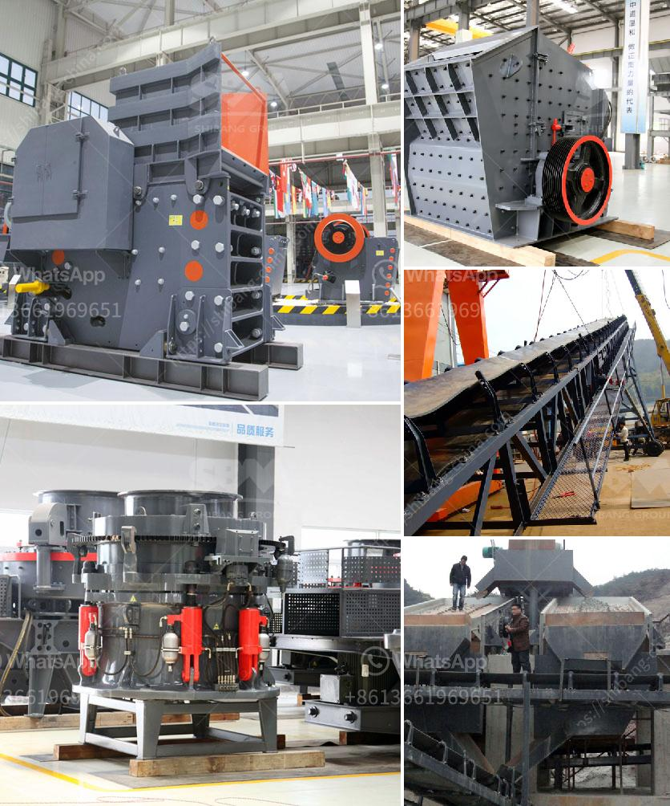

<h3>hammer mill 200 mesh</h3>
Precision agriculture has been transforming the farming industry for decades, bringing about significant advancements in crop yield and quality. One indispensable tool in this revolution is the hammer mill, which is capable of crushing materials into fine particles of 200 mesh, allowing farmers to utilize their resources more efficiently. In this article, we will explore the hammer mill's impact on precision agriculture and its ability to enhance farming practices.

The hammer mill is a crucial piece of equipment in the agricultural industry, capable of grinding materials into fine particles. These particles can then be used for a variety of purposes such as feed, fertilizers, and even fuel. Comprising a cylindrical chamber with horizontal rotating shafts, the hammer mill processes materials by feeding them into the chamber, where the rotating hammers pulverize them into smaller particles.

One significant advantage of the hammer mill is its ability to produce uniform particles of 200 mesh. Mesh size refers to the number of openings per linear inch in a screen or sieve. In the case of the hammer mill, a 200 mesh screen is used, resulting in particles of the same size. This uniformity ensures that the materials processed by the hammer mill have consistent properties, making them more valuable and efficient for various applications in precision agriculture.

The hammer mill's ability to produce 200 mesh particles is especially beneficial for precision agriculture, where the accurate application of materials is essential. When materials are processed into fine particles of uniform size, they can be more precisely distributed onto crops or incorporated into the soil. This precise application ensures that plants receive the optimal amount of nutrients or other required materials, leading to improved crop yield and quality.

Moreover, the fine particles of 200 mesh obtained through the hammer mill have increased surface area, allowing for better interaction with plants. Nutrients or other materials can be easily absorbed by the roots, resulting in efficient uptake and utilization by the crop. This improves plant health and growth while minimizing waste, as the fine particles ensure that valuable resources are utilized more effectively.

Another advantage of the hammer mill is its versatility in processing various materials. It can handle a wide range of feedstock, such as grains, agricultural residues, and even biomass. This means that farmers can utilize a variety of materials available to them, minimizing waste and maximizing resource utilization. Additionally, the ability to process different materials allows farmers to respond to market demands, as they can easily switch between different feedstocks based on industry needs.

In conclusion, the hammer mill is an indispensable tool in precision agriculture, capable of producing materials at a 200 mesh size. Its ability to create uniform particles ensures accurate application and efficient utilization of resources. The fine particles obtained through the hammer mill provide increased surface area, improving plant health and growth. Furthermore, its versatility allows farmers to utilize various feedstocks and respond to market demands. As precision agriculture continues to evolve, the hammer mill remains an integral part of farming practices, contributing to increased crop yield, quality, and sustainability.
<h3>Contact us</h3><ul><li><strong>Whatsapp:&nbsp;<a href="https://wa.me/8613661969651">+8613661969651</a></strong></li><li><a href="https://swt.shibang-china.com/?git&amp;zhl&amp;hammer mill 200 mesh"><strong>Online Service(chat now)</strong></a></li></ul><h3>Related</h3><ul><li><a href='used mobile crushing plant trailer.md'>used mobile crushing plant trailer</a></li><li><a href='how to make limestone powder.md'>how to make limestone powder</a></li><li><a href='standard operating procedure of ball mill.md'>standard operating procedure of ball mill</a></li><li><a href='calcite processing plant.md'>calcite processing plant</a></li><li><a href='cobalt ore equipments nigeria.md'>cobalt ore equipments nigeria</a></li></ul>