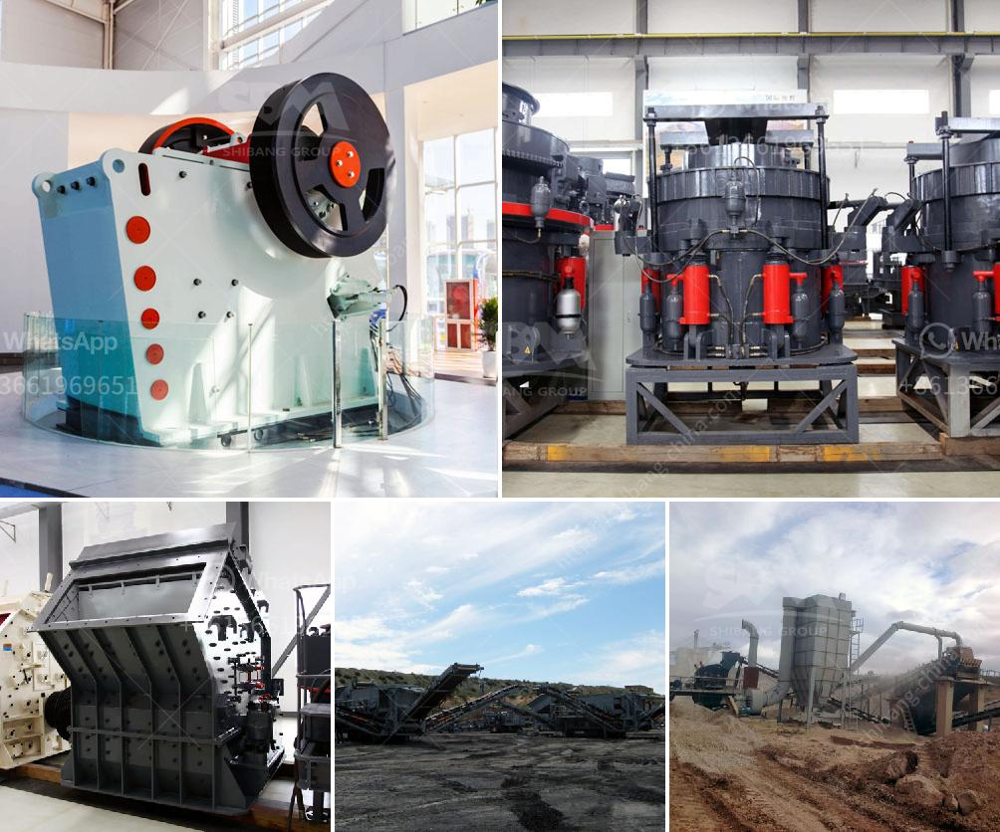

<h3>hammer mill design plans pdf mtm crusher</h3>
Hammer mill design plans pdf is a common topic in many manufacturing and engineering industries. There are several reasons why people would want to use a hammer mill, which include breaking down a variety of materials into smaller pieces, resizing and reducing the density to make it easier to transport or process materials. In this article, we will discuss some fundamental aspects of hammer mill design plans pdf.

To understand hammer mill design plans pdf, it is essential to have a good grasp of the equipment's basic components. The hammer mill consists of a rotor, which rotates at high speed inside a casing or drum. The rotor is equipped with a series of hammers, which strike the materials as they pass through the mill. The hammers can be fixed or swing freely depending on the desired crushing effect.

When designing a hammer mill, the size and shape of the rotor, the clearance between the hammers and the screen, and the size and design of the screen openings are crucial. These factors determine the final particle size and the efficiency of the grinding process.

To achieve the optimal design, engineers and manufacturers can utilize computer-aided design (CAD) software to create detailed plans and simulate the hammer mill's performance. CAD software enables designers to experiment with different configurations, test the impact of various materials, and assess the equipment's overall efficiency.

The material to be processed also plays a significant role in determining the hammer mill design. Different materials have different properties, such as hardness, density, and moisture content, which affect the grinding process. For instance, a hammer mill designed for grinding grains may differ from one designed for pulverizing biomass or recycling materials.

Furthermore, the desired output size and capacity are essential considerations when designing a hammer mill. Whether it is for producing fine powder, coarse particles, or a combination of both, the hammer mill's design needs to accommodate the specific requirements.

Safety is another vital aspect of hammer mill design plans pdf. Manufacturers must ensure that the equipment meets safety standards and incorporates features that prevent accidents or injuries. For example, the housing should be designed to minimize dust emissions and reduce the risk of explosions or fire hazards.

Lastly, to ensure the longevity and optimal performance of the hammer mill, regular maintenance and proper installation are crucial. Manufacturers should provide detailed instructions on maintenance and ensure that replacement parts are readily available.

In conclusion, hammer mill design plans pdf require careful consideration of various factors such as the rotor design, screen size, material properties, output size, and safety features. With the aid of CAD software, engineers can create detailed plans and simulations to optimize the equipment's performance. Regular maintenance and proper installation are essential to maximize the hammer mill's lifespan and efficiency.
<h3>Contact us</h3><ul><li><strong>Whatsapp:&nbsp;<a href="https://wa.me/8613661969651">+8613661969651</a></strong></li><li><a href="https://swt.shibang-china.com/?git&amp;zhl&amp;hammer mill design plans pdf mtm crusher"><strong>Online Service(chat now)</strong></a></li></ul><h3>Related</h3><ul><li><a href='distributor pulverizer crusher indonesia.md'>distributor pulverizer crusher indonesia</a></li><li><a href='kaolin crushing processing in india.md'>kaolin crushing processing in india</a></li><li><a href='ballast crusher line.md'>ballast crusher line</a></li><li><a href='bentonite powder raymond mill.md'>bentonite powder raymond mill</a></li><li><a href='conveyor belts in malaysia.md'>conveyor belts in malaysia</a></li></ul>