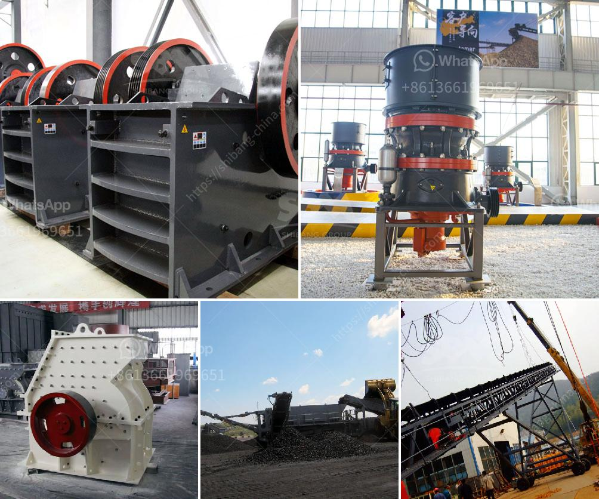

<h3>hammer mill for cerelaes</h3>
In today's fast-paced world, the demand for processed foods is at an all-time high. To meet this demand, the processing industry constantly seeks innovative technologies that can efficiently process cereals into various food products. One such technology that has revolutionized the industry is the hammer mill.

A hammer mill is a machine used to shred or crush materials into smaller pieces. It consists of a rotating shaft with free-swinging hammers attached to it. These hammers strike the material being processed, causing it to rupture into small particles. This versatile machine is widely used in the agricultural sector, particularly for processing cereals.

Cereals, such as wheat, rice, barley, and corn, are staple food crops around the world. They are rich sources of essential nutrients like carbohydrates, vitamins, and minerals. However, cereals, in their natural state, are not easily digestible. Therefore, processing them into flour or other food products is crucial to make them consumable.

Traditionally, cereals were processed using stone mills or grinding stones. While these methods have been effective for centuries, they are slow and labor-intensive. The introduction of hammer mills in the processing of cereals has significantly improved efficiency, ensuring faster and more consistent processing.

One of the key advantages of using a hammer mill for cereals is its ability to produce a uniform and fine-textured product. The hammers inside the mill exert high impact forces on the material, breaking it down into evenly sized particles. This consistency is vital for producing high-quality flour and other cereal-based products. Additionally, the fine-textured product ensures the desired smoothness in food preparations.

Hammer mills also offer versatility in terms of the variety of cereals they can process. Whether it is wheat, rice, or corn, the machine can efficiently grind and process them all. This flexibility is crucial for food manufacturers, allowing them to diversify their product range and cater to different consumer preferences.

Another significant advantage of hammer mills for cereals is their compact design and ease of operation. These machines can be easily integrated into existing processing lines, maximizing productivity without requiring significant modifications. Moreover, they are simple to operate, requiring minimal training for operation and maintenance.

The utilization of hammer mills in the cereal processing industry has not only improved productivity but also contributed to sustainability. Unlike traditional stone mills, hammer mills are powered by electricity or fuel, reducing the dependency on manual labor. This transition has led to increased efficiency and reduced production costs, benefiting both manufacturers and consumers.

In conclusion, the hammer mill has emerged as a game-changer in the cereals processing industry. Its ability to produce uniform and fine-textured products, process a variety of cereals, and its compact design and ease of operation make it an integral part of modern processing lines. The hammer mill's impact on productivity and sustainability is undeniable, solidifying its position as a vital tool for cereal processing. As the demand for processed cereals continues to rise, the hammer mill stands ready to streamline the industry and fulfill the evolving needs of consumers worldwide.
<h3>Contact us</h3><ul><li><strong>Whatsapp:&nbsp;<a href="https://wa.me/8613661969651">+8613661969651</a></strong></li><li><a href="https://swt.shibang-china.com/?git&amp;zhl&amp;hammer mill for cerelaes"><strong>Online Service(chat now)</strong></a></li></ul><h3>Related</h3><ul><li><a href='starting up a small scale gold mine in zimbabwe.md'>starting up a small scale gold mine in zimbabwe</a></li><li><a href='stones crushing machine in south africa for sale.md'>stones crushing machine in south africa for sale</a></li><li><a href='equipments used in cement industry.md'>equipments used in cement industry</a></li><li><a href='stone crusher machines in peru.md'>stone crusher machines in peru</a></li><li><a href='how to start stone crusher project.md'>how to start stone crusher project</a></li></ul>