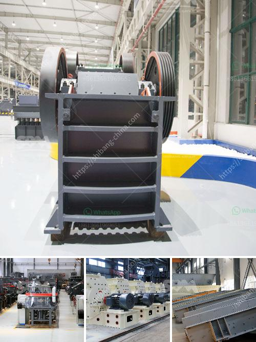

<h3>hammer mill machine</h3>
The hammer mill machine is a device that is used to crush materials into fine particles or to reduce the size of a solid material. This machine can be used in various industries, such as the metallurgical industry, mining industry, cement industry, and construction industry.

The hammer mill machine operates on the principle of impact crushing. This means that the material is fed into the machine, and it is crushed by the impact of the hammers that rotate at high speed inside the machine's chamber. The hammers can be fixed or swinging, depending on the application and the desired output.

One of the main advantages of the hammer mill machine is its versatility. It can be used to grind, crush, or pulverize a wide range of materials, such as grains, herbs, and even fibrous materials like bamboo and coconut husk. This makes it a popular choice in the agricultural industry, where it is used to process grains and animal feed.

In the mining industry, the hammer mill machine is used to crush and grind various types of rocks and ores. It is also used to pulverize coal for burning in power plants. The machine's high-speed rotating hammers create a forceful impact, which breaks the materials into smaller pieces. This process is known as comminution and is essential in the extraction of valuable minerals from the ore.

The construction industry also benefits from the hammer mill machine. It is used to process construction waste, such as concrete debris and bricks, into reusable aggregates. These aggregates can be used as a base material for new construction projects, reducing the need for extracting and processing natural resources.

Another important application of the hammer mill machine is in the recycling industry. It can be used to shred and crush recyclable materials like paper, cardboard, plastic bottles, and aluminum cans. The shredded materials can then be further processed and used to produce new products, reducing the demand for virgin materials and minimizing waste.

The hammer mill machine comes in different sizes and configurations, depending on the application and desired output. Smaller machines are suitable for laboratory use or for processing small amounts of materials, while larger machines are used in industrial settings for high-volume production.

In summary, the hammer mill machine is a versatile and indispensable device in various industries. Its ability to crush, grind, and pulverize materials makes it a valuable tool for processing raw materials, reducing waste, and extracting valuable minerals. Whether it is used in the mining, construction, or recycling industry, the hammer mill machine plays a crucial role in the production process and contributes to sustainable development by promoting resource efficiency.
<h3>Contact us</h3><ul><li><strong>Whatsapp:&nbsp;<a href="https://wa.me/8613661969651">+8613661969651</a></strong></li><li><a href="https://swt.shibang-china.com/?git&amp;zhl&amp;hammer mill machine"><strong>Online Service(chat now)</strong></a></li></ul><h3>Related</h3><ul><li><a href='price ball mill 40tph.md'>price ball mill 40tph</a></li><li><a href='ball mill capacity.md'>ball mill capacity</a></li><li><a href='best stone crusher in kenya.md'>best stone crusher in kenya</a></li><li><a href='aggregate washing plant saudi arabia.md'>aggregate washing plant saudi arabia</a></li><li><a href='grinding of calcined gypsum.md'>grinding of calcined gypsum</a></li></ul>