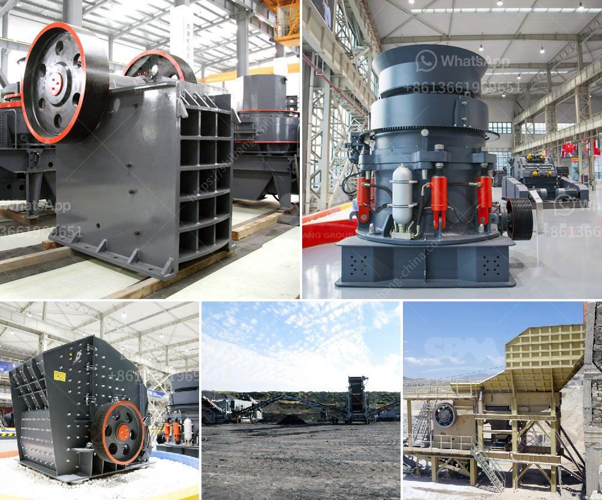

<h3>hammer mill prices</h3>
A hammer mill is a versatile machine used in various industries for an array of different purposes. In the agricultural sector, hammer mills are used to grind down crops into fine flour for animal feed or to pulp wood for paper production. For industrial processes, a hammer mill is often essential when breaking down ore deposits into finer particles. But what are the key factors to consider when purchasing a hammer mill and how do these factors impact the prices of these machines?

Firstly, the type of hammer mill one chooses to purchase can affect its price. There are several different types of hammer mills, including those with screens, full circle screen hammer mills, and horizontal hammer mills. Each type has its own unique features and functionalities, which can significantly impact the price. For example, hammer mills with screens are more expensive compared to those without, as screens allow for more precise milling results.

The power requirements of a hammer mill also play a role in determining its price. Hammer mills come in a range of sizes and power ratings, from smaller models suitable for home use to larger industrial-sized machines. Naturally, the more power a hammer mill requires, the higher its price. It is essential to assess one's power needs accurately to choose a hammer mill that will provide the desired results without unnecessary financial burden.

Another determinant of hammer mill prices is the material of construction. Hammer mills can be made from various materials, including stainless steel, cast iron, and carbon steel. The choice of material will depend on factors such as the intended use of the machine, durability requirements, and cost considerations. Typically, stainless steel hammer mills tend to be more expensive than their counterparts made from cast iron or carbon steel.

Additional features and customization options can also impact the price of a hammer mill. Some manufacturers offer optional features such as variable speed controls, automatic lubrication systems, and built-in dust collection systems. While these features can enhance the efficiency and convenience of the machine, they can also add to the overall cost.

Geographical location and market demand can also contribute to variations in hammer mill prices. Different regions might have different manufacturing costs, labor expenses, and import/export tariffs, which can affect the price of a hammer mill. Additionally, market demand in a particular area can drive up prices due to limited supply or increased competition. It's always prudent to research and compare prices from different suppliers to ensure a fair deal.

In conclusion, hammer mill prices can vary significantly depending on various factors. The type of hammer mill, power requirements, material of construction, additional features, and market conditions are all influential factors. Therefore, one must carefully assess their needs and budget while conducting thorough research to find a hammer mill that offers the desired functionalities at a reasonable price. Investing in a high-quality hammer mill is crucial for industries that require efficient and reliable particle size reduction processes.
<h3>Contact us</h3><ul><li><strong>Whatsapp:&nbsp;<a href="https://wa.me/8613661969651">+8613661969651</a></strong></li><li><a href="https://swt.shibang-china.com/?git&amp;zhl&amp;hammer mill prices"><strong>Online Service(chat now)</strong></a></li></ul><h3>Related</h3><ul><li><a href='1 tonne gypsum processing machine.md'>1 tonne gypsum processing machine</a></li><li><a href='aggregate washing plant price.md'>aggregate washing plant price</a></li><li><a href='crusher and screening plant price south africa.md'>crusher and screening plant price south africa</a></li><li><a href='costs of a grinding mill.md'>costs of a grinding mill</a></li><li><a href='jaw crusher used india.md'>jaw crusher used india</a></li></ul>