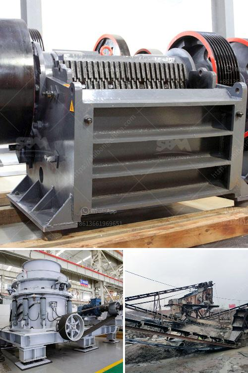

<h3>hammer mills for sand</h3>
Hammer mills are machines used in the industry to reduce large pieces of material into smaller particles, such as sand. They are very versatile machines that can handle a wide range of materials, including aggregates, coal, limestone, paper, and even spices.

The basic design of a hammer mill involves a rotating shaft fitted with free-swinging hammers, which are used to break down the material. As the hammers rotate, they collide with the material, crushing it into smaller particles. The size of the final product is determined by the size of the hammer mill's screen openings.

One of the key advantages of using hammer mills for sand production is their ability to produce a consistent, uniform particle size. This is essential when producing sand for use in industries like construction, where the quality of the sand is crucial. The adjustable screen openings allow the operator to control the size of the final product, ensuring that it meets the required specifications.

Another advantage of using hammer mills for sand production is their high throughput capacity. These machines are capable of processing large volumes of material quickly and efficiently. This is especially important in industries that require a continuous supply of sand, such as concrete production.

In addition to their high production capacity, hammer mills also offer the benefit of low maintenance and operating costs. Their simple design and robust construction make them reliable machines that require minimal downtime for maintenance.

Overall, hammer mills are an important tool in the sand production industry. Their ability to produce a uniform particle size, high throughput capacity, and low maintenance costs make them a preferred choice for producers looking to produce high-quality sand efficiently. With their versatility and wide range of applications, hammer mills are likely to continue being an integral part of the sand production industry for years to come.
<h3>Contact us</h3><ul><li><strong>Whatsapp:&nbsp;<a href="https://wa.me/8613661969651">+8613661969651</a></strong></li><li><a href="https://swt.shibang-china.com/?git&amp;zhl&amp;hammer mills for sand"><strong>Online Service(chat now)</strong></a></li></ul><h3>Related</h3><ul><li><a href='vertical roller mill price.md'>vertical roller mill price</a></li><li><a href='chain conveyors crushers.md'>chain conveyors crushers</a></li><li><a href='complete gold refinery for sale in south africa.md'>complete gold refinery for sale in south africa</a></li><li><a href='defination of machine aggregate crusher.md'>defination of machine aggregate crusher</a></li><li><a href='stone crusher for concrete.md'>stone crusher for concrete</a></li></ul>