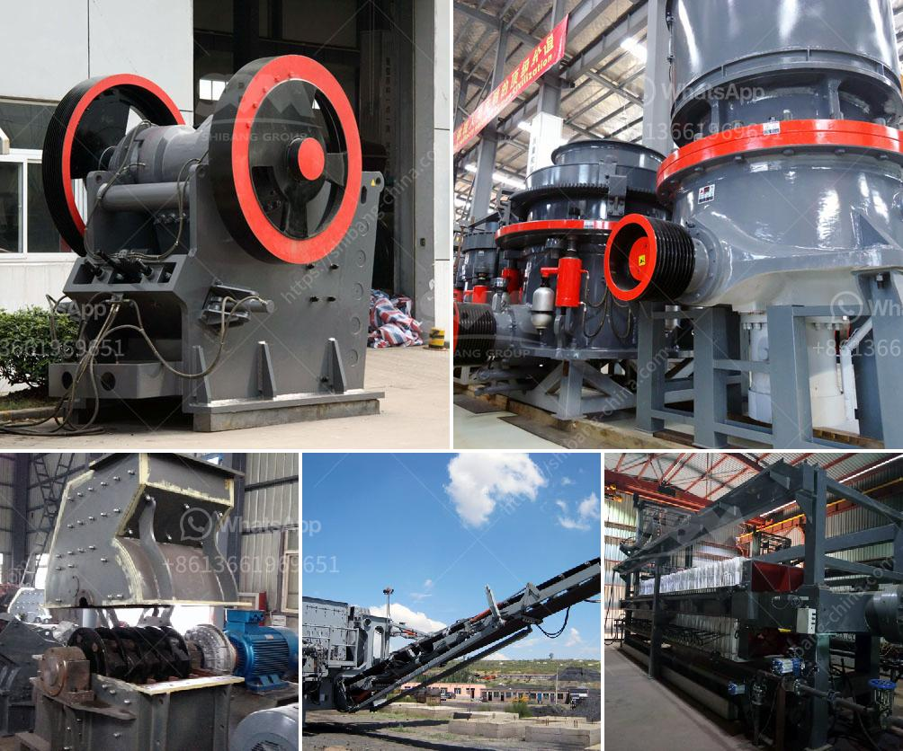

<h3>hammer mills in south africa</h3>
Hammer mills are popular in many different industries in South Africa due to their numerous benefits. Their ability to process a wide array of materials, both wet and dry, makes them highly versatile equipment that is used in various applications across different sectors. This article will explore the uses and advantages of hammer mills in South Africa.

Hammer mills are machines that grind, crush, and pulverize materials into fine particles. These machines consist of a rotor with hammers that rotate at high speed, striking the material and breaking it into pieces. The size of the final product can be controlled by adjusting the position of the hammers or screens within the machine.

One of the primary uses of hammer mills in South Africa is grinding grains into flour. This process is done by feeding the grains into the grinder, which breaks them down until they reach the desired consistency. Hammer mills are known for their efficiency in producing high-quality flour quickly and easily, making them a favorite among millers and bakers.

In addition to grinding grains, hammer mills are also used for grinding other agricultural products like corn cobs, stalks, and wood chips. These machines are effective in reducing these materials into smaller, more manageable pieces, which can then be used as animal feed or as raw materials for various industrial processes. Farmers and wood manufacturers in South Africa rely on hammer mills to process their waste and surplus materials efficiently.

Furthermore, hammer mills are utilized in the mining industry to crush and grind minerals and stones. They are commonly used in extracting precious metals like gold and silver from ores, as well as crushing rocks to extract valuable minerals. Hammer mills play a crucial role in the mineral processing industry, facilitating the extraction of minerals with maximum efficiency.

One of the advantages of hammer mills is their cost-effectiveness. Compared to other grinding equipment, hammer mills are relatively affordable, making them accessible to small-scale farmers and businesses in South Africa. This affordability allows these industries to produce high-quality products at a lower cost, boosting their competitiveness in the market.

Another benefit of hammer mills is their ability to handle both wet and dry materials. This versatility makes them suitable for many different applications in various industries. Whether it is grinding wet grains or crushing dry rocks, hammer mills can efficiently process a wide range of materials, making them a valuable asset for different businesses.

Despite their benefits, it is essential to note that proper maintenance is crucial to ensure the longevity and efficiency of hammer mills. Regular cleaning and maintenance, including replacing worn-out parts, will ensure optimal performance and prevent breakdowns. Therefore, businesses that utilize hammer mills should invest in regular maintenance to maximize their benefits and minimize downtime.

In conclusion, hammer mills are versatile machines with various applications in South Africa. From grinding grains and agricultural products to crushing minerals and stones, these machines offer numerous advantages, including cost-effectiveness, versatility, and efficiency. Businesses in South Africa can benefit greatly from incorporating hammer mills into their operations, enabling them to produce high-quality products and remain competitive in the market.
<h3>Contact us</h3><ul><li><strong>Whatsapp:&nbsp;<a href="https://wa.me/8613661969651">+8613661969651</a></strong></li><li><a href="https://swt.shibang-china.com/?git&amp;zhl&amp;hammer mills in south africa"><strong>Online Service(chat now)</strong></a></li></ul><h3>Related</h3><ul><li><a href='stone crusher plant south africa.md'>stone crusher plant south africa</a></li><li><a href='stone crusher machine assembling flow chart.md'>stone crusher machine assembling flow chart</a></li><li><a href='hp series cone crusher.md'>hp series cone crusher</a></li><li><a href='jaw stone crusher in turkey.md'>jaw stone crusher in turkey</a></li><li><a href='rock grinding mill price in india.md'>rock grinding mill price in india</a></li></ul>