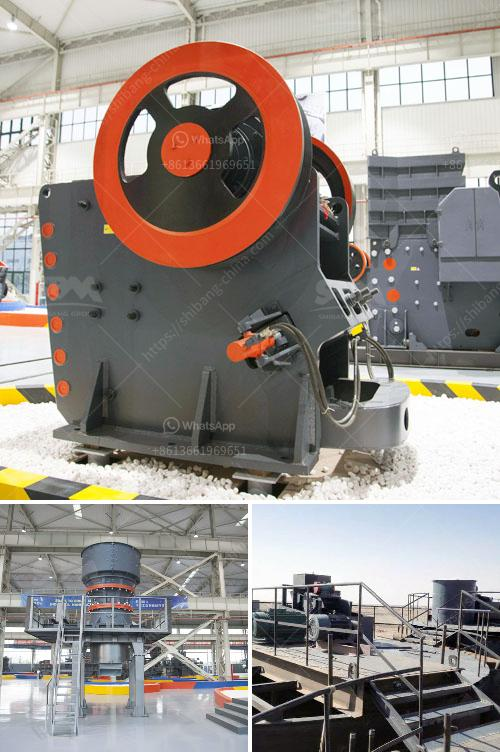

<h3>hammer mills used in gold mining</h3>
Among the key components that enable profitable mining operations is the crushing of extracted material. Progressive industries are looking to solutions that optimize their processes and ensure maximum productivity. Hammer mills play a crucial role in gold mining activities due to their ability to crush and pulverize hard rock materials into smaller pieces.

A hammer mill is a machine composed of a rotating shaft fitted with several hammers aimed at obtaining particles of a desired size by introducing them into a grinding chamber. The raw materials are fed into the grinding chamber through a feed chute, and are struck by the rotating hammers in order to reduce their size. In the case of gold mining, the goal is to extract gold minerals trapped within rock formations using a hammer mill.

To achieve this, miners use various techniques including hyper-spectral imaging, X-ray technology, and, most commonly, the use of chemical reagents to break down the associated mineral matter. Once the rock has been crushed into smaller fragments, it becomes easier to separate the gold particles from the rest of the ore.

Hammer mills are highly efficient at breaking down materials, especially hard or abrasive ones. They are able to reduce the size of particles to a more manageable level, ensuring that gold particles are liberated from the host rock. This increases the efficiency of the subsequent gold extraction processes such as gravity concentration or flotation.

The use of hammer mills in gold mining offers several advantages. Firstly, they provide a significant reduction in the amount of energy required to break down the material. Traditionally, the process of crushing rocks using a hammer mill involved the use of large, energy-consuming machines that required a substantial amount of power. With advancements in technology, modern hammer mills are now able to minimize energy consumption while maximizing production rates.

Secondly, hammer mills offer versatility in terms of the size and type of ore they can handle. They can be used to process both hard rocks and softer materials like limestone and coal. This flexibility makes them ideal for gold mining applications where the mineral composition of the ore may vary significantly.

Moreover, hammer mills can be easily adjusted to produce particles of different sizes, making them suitable for a range of gold recovery processes. For instance, fine-sized particles can be extremely beneficial for flotation recovery, while larger particles may be more amenable to traditional gravity separation methods.

In conclusion, hammer mills represent a powerful tool in the world of gold mining. With their ability to crush and pulverize hard rock materials, they have become indispensable in the industry. Furthermore, their size and flexibility make them highly versatile, allowing miners to extract gold from various ore types. As miners strive to optimize their operations and increase productivity, hammer mills will continue to play a vital role in gold extraction.
<h3>Contact us</h3><ul><li><strong>Whatsapp:&nbsp;<a href="https://wa.me/8613661969651">+8613661969651</a></strong></li><li><a href="https://swt.shibang-china.com/?git&amp;zhl&amp;hammer mills used in gold mining"><strong>Online Service(chat now)</strong></a></li></ul><h3>Related</h3><ul><li><a href='crusher 40 ton per jam.md'>crusher 40 ton per jam</a></li><li><a href='slag grinderr capling.md'>slag grinderr capling</a></li><li><a href='dealers of hammer mill in nigeria.md'>dealers of hammer mill in nigeria</a></li><li><a href='stone dust making machine.md'>stone dust making machine</a></li><li><a href='machinery for hydrated lime powder.md'>machinery for hydrated lime powder</a></li></ul>