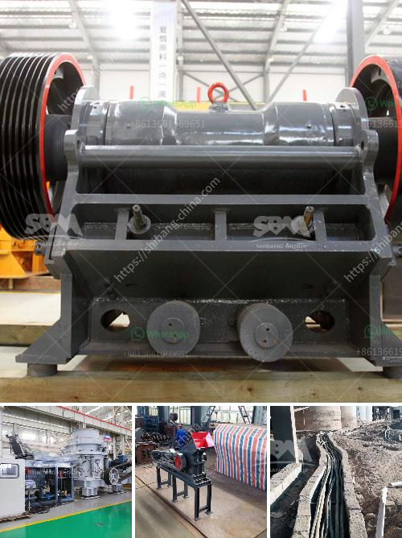

<h3>hammer pulverizer machine price</h3>
Are you in search of a hammer pulverizer machine for your industrial or commercial needs? Well, look no further! In this article, we will discuss the price range of a hammer pulverizer machine and its benefits for your business.

Firstly, let's understand what a hammer pulverizer machine is. This machine is commonly used in various industries such as mining, construction, and chemical engineering. It is designed to crush or pulverize large solid materials into smaller pieces. The main mechanism of this machine involves rotating hammers that strike the material, effectively reducing its size.

Now, coming to the price range of a hammer pulverizer machine, it can vary depending on several factors. These factors include the size and capacity of the machine, the brand, and any additional features it may have. On average, you can expect the price of a hammer pulverizer machine to fall anywhere between $1000 to $20,000. However, keep in mind that these are just estimated prices, and you should contact suppliers or manufacturers for accurate figures.

When considering the price, it's important to note the benefits of investing in a hammer pulverizer machine. Firstly, the machine increases the efficiency of your operations. The pulverization process allows for faster and easier handling of materials, resulting in increased productivity and reduced labor costs. It also ensures uniform particle size, which is crucial for many industries.

Another advantage of a hammer pulverizer machine is its versatility. It can be used to crush a wide range of materials, including rocks, ores, construction waste, and even plastic. This flexibility makes it an ideal choice for businesses dealing with various materials.

Furthermore, a hammer pulverizer machine requires minimal maintenance, making it a cost-effective solution for business owners. With routine inspections and timely repairs, you can prolong the machine's lifespan and avoid costly breakdowns. Additionally, most machines come with user-friendly controls and safety features, ensuring a safe working environment for your employees.

In conclusion, a hammer pulverizer machine offers numerous benefits for businesses in need of material pulverization. It enhances efficiency, versatility, and requires low maintenance. As for the price range, it can vary depending on factors such as size, capacity, brand, and additional features. However, with proper research and contacting suppliers or manufacturers, you can find a machine that suits your budget and meets your requirements. So, don't hesitate to invest in a hammer pulverizer machine and take your business operations to the next level!
<h3>Contact us</h3><ul><li><strong>Whatsapp:&nbsp;<a href="https://wa.me/8613661969651">+8613661969651</a></strong></li><li><a href="https://swt.shibang-china.com/?git&amp;zhl&amp;hammer pulverizer machine price"><strong>Online Service(chat now)</strong></a></li></ul><h3>Related</h3><ul><li><a href='concrete waste crusher plant malaysia.md'>concrete waste crusher plant malaysia</a></li><li><a href='olx used crusher machines.md'>olx used crusher machines</a></li><li><a href='application of ball mill in industries.md'>application of ball mill in industries</a></li><li><a href='1 tonne gypsum processing machine.md'>1 tonne gypsum processing machine</a></li><li><a href='komatsu mobile crushers price.md'>komatsu mobile crushers price</a></li></ul>