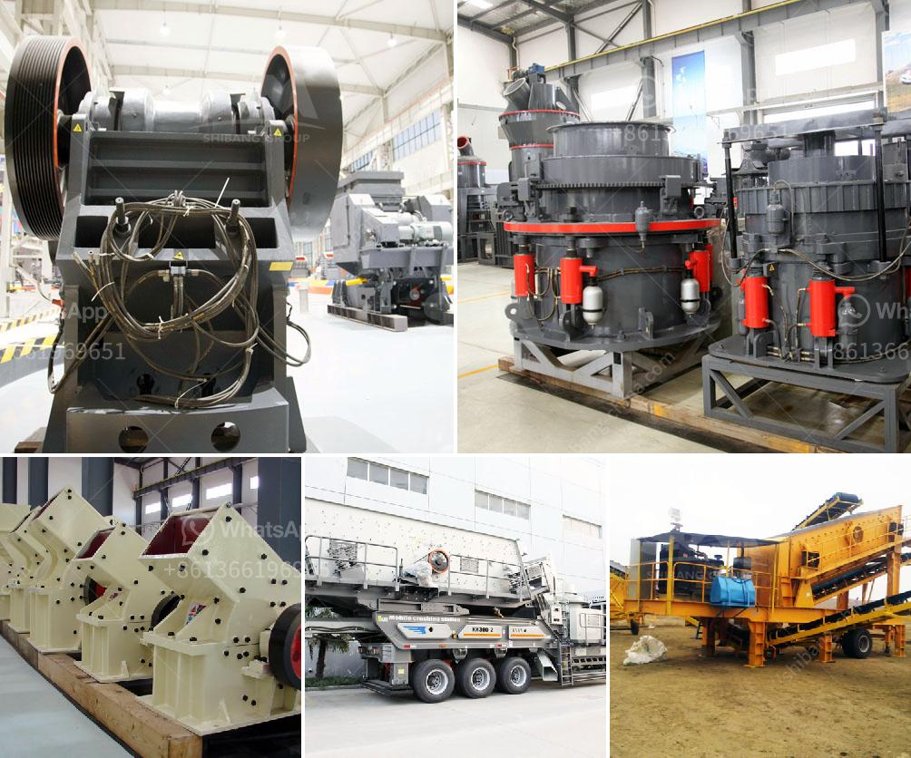

<h3>hammer pulverizer machine</h3>
In the world of industrial machinery, a hammer pulverizer machine is a vital equipment used in various industries for diverse purposes. It is a versatile machine that enables efficient and effective grinding, shredding, crushing, and pulverizing materials to the desired fineness or size.

The hammer pulverizer machine is widely used in industries such as agriculture, mining, food processing, chemical, and pharmaceutical industries for grinding materials like spices, grains, herbs, coal, minerals, and many more. It is particularly useful for reducing the size of bulky materials into smaller particles, thus facilitating further processing or improving the performance of the end product.

One of the key features of the hammer pulverizer machine is its hammer-shaped rotor assembly, which is equipped with several hammers or blades that rotate at high speed. As the rotor spins, the hammers strike the materials fed into the machine, causing them to be crushed or pulverized into smaller particles.

The typical construction of a hammer pulverizer machine consists of a housing or a chamber that encloses the rotor assembly, a feed chute for the materials, and an outlet or discharge area to collect the pulverized material. Oftentimes, these machines are also equipped with a screen or mesh at the bottom of the chamber to control the size of the final product.

The advantages of using a hammer pulverizer machine are manifold. Firstly, it offers high-speed pulverization, allowing for quick and efficient processing of large quantities of materials. Secondly, its versatility enables the grinding of a wide range of materials, making it suitable for various applications. Additionally, it requires low maintenance, ensuring cost-effectiveness and minimal downtime.

In the agricultural sector, hammer pulverizer machines are extensively utilized for grinding grains, such as wheat, corn, and rice. By pulverizing these grains into smaller particles, farmers and feed manufacturers can create nutritious animal feed that is easier to digest, ultimately leading to healthier livestock.

Furthermore, in the mining industry, hammer pulverizers are used for crushing and grinding minerals, rocks, and ores. The pulverized material can then be mixed with water or chemical additives to create slurries or fine powders, which are crucial for mineral processing, metal extraction, and mineral refinement processes.

Moreover, in the food processing and pharmaceutical industries, hammer pulverizers are essential equipment for grinding spices, herbs, and other ingredients. These finely ground powders are then used in the production of various food products, sauces, seasonings, and medicinal formulations.

It is worth noting that hammer pulverizer machines are available in different sizes, capacities, and specifications to suit the specific requirements of different industries. Some machines are designed for small-scale operations, while others are built for heavy-duty industrial use, capable of processing tons of materials per hour.

In conclusion, the hammer pulverizer machine is an indispensable equipment in various industries. Its versatility, high-speed operation, and ability to finely grind or pulverize materials make it an essential tool for efficient and effective processing. Whether it is in agriculture, mining, food processing, or chemical industries, the hammer pulverizer machine plays a vital role in achieving desired product quality and enhancing productivity.
<h3>Contact us</h3><ul><li><strong>Whatsapp:&nbsp;<a href="https://wa.me/8613661969651">+8613661969651</a></strong></li><li><a href="https://swt.shibang-china.com/?git&amp;zhl&amp;hammer pulverizer machine"><strong>Online Service(chat now)</strong></a></li></ul><h3>Related</h3><ul><li><a href='new mini portable rock impact crusher.md'>new mini portable rock impact crusher</a></li><li><a href='roller mill nigeria.md'>roller mill nigeria</a></li><li><a href='barite mining process.md'>barite mining process</a></li><li><a href='vertical ball mills of india.md'>vertical ball mills of india</a></li><li><a href='closing of crushing plant.md'>closing of crushing plant</a></li></ul>