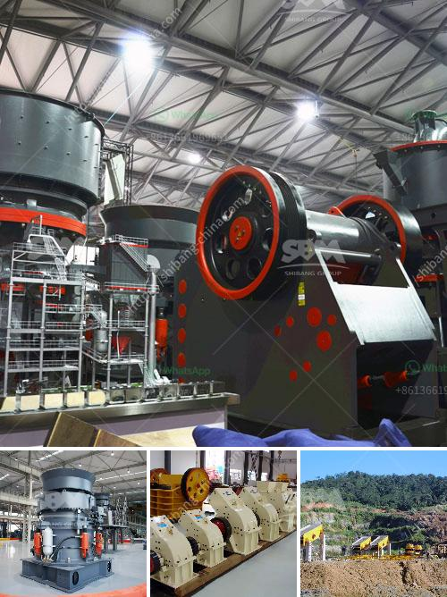

<h3>hand gold washing plant sale</h3>
In recent years, there has been a growing recognition of the importance of sustainable mining practices. With the increasing demand for gold and other precious metals, it is crucial to find solutions that minimize the negative impact of mining on the environment. One such solution is the hand gold washing plant, which has gained popularity among artisanal miners around the world.

A hand gold washing plant is a portable device that is specifically designed to maximize gold recovery from alluvial deposits. It operates through a combination of mechanical shaking and water flow, which separates gold particles from other sediment and gravel. This method is particularly effective in areas where access to heavy machinery is limited or where environmental regulations restrict the use of such equipment.

The compact size and portability of a hand gold washing plant make it ideal for small-scale miners or individuals who want to try their luck at gold panning. It can be easily transported to remote locations and set up within minutes. Additionally, it does not require a significant amount of water for operation, which is a crucial factor in water-scarce regions.

The sale of hand gold washing plants has gained traction in recent years due to its numerous advantages. Firstly, it allows for a more sustainable and responsible approach to gold mining. Artisanal miners, who often rely on traditional mining methods, can now access a more efficient and environmentally friendly tool. This contributes to the reduction of deforestation, soil erosion, and water pollution associated with conventional mining.

Secondly, the hand gold washing plant offers economic benefits to local communities. Traditional miners can increase their productivity and recover more gold in a shorter period. This leads to improved livelihoods and economic growth, as the income generated from gold mining can be invested back into the community, supporting infrastructure development and education.

Furthermore, the hand gold washing plant encourages responsible mining practices. Miners using this equipment are more likely to comply with regulations regarding the use of mercury, a highly toxic substance commonly used to extract gold. The hand gold washing plant significantly reduces the need for mercury, making the mining process safer for both miners and the environment.

It is important to note that while the hand gold washing plant has many advantages, it is not a panacea for all the challenges associated with gold mining. It does not eliminate the need for proper regulation, including the enforcement of responsible mining practices and the protection of human rights. Governments and international organizations must work together to ensure that the implementation of hand gold washing plants is accompanied by comprehensive reforms that address the social, environmental, and economic aspects of mining.

In conclusion, the sale of hand gold washing plants presents an opportunity for a more sustainable and responsible approach to gold mining. By providing an efficient, portable, and low-impact method of gold recovery, it empowers small-scale and artisanal miners to extract gold while minimizing environmental damage. However, it is essential to pursue a holistic and comprehensive approach to mining reform to ensure that the benefits of this technology are maximized for both the miners and the environment.
<h3>Contact us</h3><ul><li><strong>Whatsapp:&nbsp;<a href="https://wa.me/8613661969651">+8613661969651</a></strong></li><li><a href="https://swt.shibang-china.com/?git&amp;zhl&amp;hand gold washing plant sale"><strong>Online Service(chat now)</strong></a></li></ul><h3>Related</h3><ul><li><a href='iron ore pelletisation plant china.md'>iron ore pelletisation plant china</a></li><li><a href='rock crushing machine speed limit.md'>rock crushing machine speed limit</a></li><li><a href='by products of limestone processing.md'>by products of limestone processing</a></li><li><a href='crusher and producton per hour.md'>crusher and producton per hour</a></li><li><a href='companies that manufacture ball mill.md'>companies that manufacture ball mill</a></li></ul>