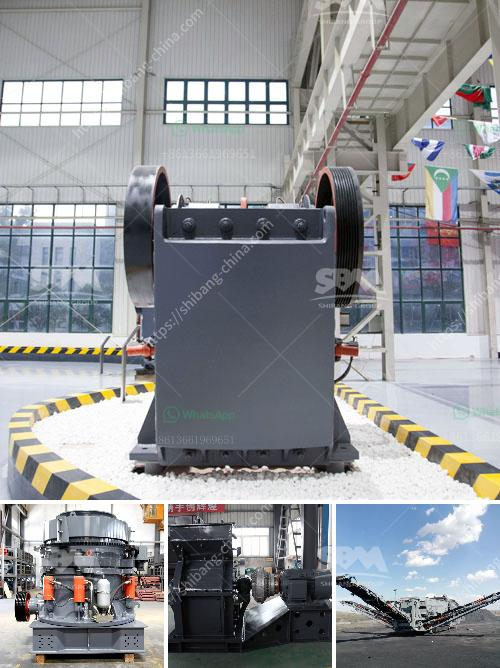

<h3>hand portable rock crusher</h3>
Rock crushers are essential tools in many construction and mining projects. They assist in breaking down larger rocks into smaller, more manageable pieces. Hand portable rock crushers offer an efficient means to reduce materials such as stone, concrete, or asphalt into smaller, more refined particles.

Depending on the model, these crushers can process materials at a rate of about 1 ton per hour, enabling you to quickly complete many construction or mining tasks. Their versatility, combined with their portability, makes them an essential tool for various projects. Let's delve deeper into the features and benefits of a hand portable rock crusher.

One of the greatest advantages of a hand portable rock crusher is its mobility. These crushers are small and lightweight enough to be transported by hand or loaded onto a trailer, making them ideal for remote locations or tight spaces inaccessible to larger machinery. This mobility allows you to bring the crusher directly to the site where it's needed, reducing the time and cost associated with transporting materials.

Despite their compact size, hand portable rock crushers are powerful machines. They use a motor-driven jaw or hammer mechanism to crush rocks into smaller pieces. This crushing process is remarkably efficient, allowing you to maximize the amount of material processed per hour. When operated properly, these crushers can consistently produce high-quality crushed material that meets your project's specifications.

The innovative design of hand portable rock crushers enhances safety and ease of use. Many models come with user-friendly features such as adjustable jaws, which allow you to vary the size of the crushed material. Additionally, the crushers are typically equipped with a safety switch that stops the motor when the hopper is opened, preventing any potential accidents.

Another crucial feature of hand portable rock crushers is their durability and reliability. Most crushers are constructed using high-quality materials that can withstand the rigors of construction and mining environments. This means they can endure heavy usage, ensuring that your investment lasts for years.

Hand portable rock crushers are also an environmentally friendly option. By reducing the need for larger machinery, they minimize fuel consumption and carbon emissions. Additionally, these crushers allow you to recycle and reuse materials, reducing waste and promoting sustainable practices.

In conclusion, hand portable rock crushers are an invaluable tool for construction and mining projects. Their mobility, power, versatility, and safety features make them an efficient and practical solution. Whether you are breaking down rocks for a new road, preparing materials for an upcoming construction project, or mining precious minerals, a hand portable rock crusher is a reliable and cost-effective option. Invest in this tool today to enhance your productivity and achieve exceptional results in your projects.
<h3>Contact us</h3><ul><li><strong>Whatsapp:&nbsp;<a href="https://wa.me/8613661969651">+8613661969651</a></strong></li><li><a href="https://swt.shibang-china.com/?git&amp;zhl&amp;hand portable rock crusher"><strong>Online Service(chat now)</strong></a></li></ul><h3>Related</h3><ul><li><a href='for sale used mobile jaw crusher australia.md'>for sale used mobile jaw crusher australia</a></li><li><a href='gypsum manufacturer gypsum manufacturers.md'>gypsum manufacturer gypsum manufacturers</a></li><li><a href='harga stone crusher 250 ton jam indonesia.md'>harga stone crusher 250 ton jam indonesia</a></li><li><a href='steel rolling mill plant suppliers.md'>steel rolling mill plant suppliers</a></li><li><a href='cost 100tpd cement plant india.md'>cost 100tpd cement plant india</a></li></ul>