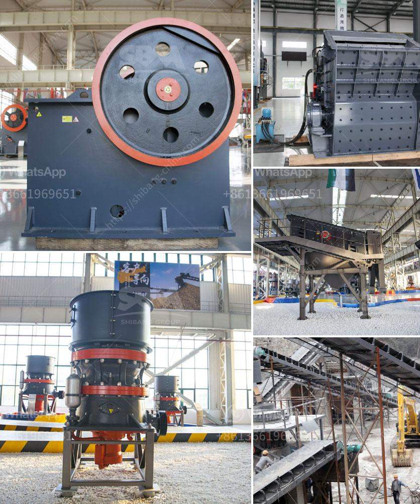

<h3>hand stone crushing machines uganda</h3>
Hand stone crushing machines uganda is a leading global manufacturer of crushing and milling equipment (hand stone crushing machines uganda), also supply individual (hand stone crushing machines uganda...) crushers and mills as well as spare parts of them. For many years, apart from standard mining equipment, we also offer customers plants specifically designed to suit each customer's unique individual needs. These include stationary primary crushers, stationary secondary crushers, sand making machines, track-mounted crushing plants, etc.

With the increasing demand of mobile stone crushers in Uganda, Zuoya Machinery Limited has developed innovative mobile stone crushers that can fulfill the need of crushed stone anywhere and anytime. Mobile stone crushers are capable of crushing basalt rock at the mines location and can be loaded into a stone crusher(lorry) to be transported to the main customer. Zuoya Machinery Limited's comprehensive range of mobile crushing plants and mobile screens, such as jaw crushers, impact crushers, cone crushers, sand making machines, etc., is capable of dealing with the various kinds of stones and construction waste. Zuoya's mobile crushing equipment is favored by customers due to their high quality and efficiency in crushing construction waste and producing rocks and sand.

Hand stone crushing machines uganda are used for mining as well as processing the metals extracted. Metals are used extensively in a number of industries as well as in day-to-day life, from automobiles to buildings to musical instruments; metals are everywhere and the demand never-stopping. This is why these products are important for multiple industrial and scientific processes. Be it agricultural industries or geological ones, they are utilized in multiple sectors of production. Alibaba.com understands the importance of these stones in the industries and hence the reason why it has come up with a wide range of natural hand stone crushing machines uganda.

The hand stone crushing machines uganda are available in a wide variety of models and their capacities may vary for each. The hand stone crushing machines uganda category featured at Alibaba.com comprises a variety of semi-automatic, automatic and manual versions that you can choose depending on your exact requirements. They are ISO and CE certified and are highly sustainable.

With heavy motor power and easy maneuverability, these hand stone crushing machines uganda are ideal for industries and businesses. These hand stone crushing machines uganda are lighter in weight, come with compact structures, along with better and bigger production capacities. Double the production efficiency and enhance your outputs with the aid of these machines and select from a greater variety of hand stone crushing machines uganda options to save loads of money. They come with quality certifications that ensure reliability too. OEM orders are accepted with customized packaging options.

Legislative and policy framework for environmental impact assessment (EIA) in Uganda is modified to cater for the complexity of the mineral sector. The legal framework is based on the 1995 constitution, the Environmental Management Act, 2004, the Mining Act, 2003 and various regulations. These legislations require mining companies in Uganda to conduct EIA prior to the start of the mining operations. The EIA process is guided by regulations under the Mining Act and the Environmental Management Act.1

Overall, the hand stone crushing machines uganda is capable of breaking rocks into different sizes of crushed stone that can be used for various purposes, including concrete production, road construction, base fill for drainage structures, and landscaping. By providing customers with comprehensive solutions, Zuoya Machinery Limited is committed to improving the efficiency and profitability of their operations. Whether as a primary crusher or a secondary, Zuoya Machinery Limited's machines work for their customers in the mining, aggregates, and recycling industries to achieve the desired end product.
<h3>Contact us</h3><ul><li><strong>Whatsapp:&nbsp;<a href="https://wa.me/8613661969651">+8613661969651</a></strong></li><li><a href="https://swt.shibang-china.com/?git&amp;zhl&amp;hand stone crushing machines uganda"><strong>Online Service(chat now)</strong></a></li></ul><h3>Related</h3><ul><li><a href='cement manufacturing process ppt.md'>cement manufacturing process ppt</a></li><li><a href='construction waste recycling.md'>construction waste recycling</a></li><li><a href='stone quarry machine manufacturers.md'>stone quarry machine manufacturers</a></li><li><a href='company that sells vibratory sieves in spain.md'>company that sells vibratory sieves in spain</a></li><li><a href='suppliers of chromite sand from south africa.md'>suppliers of chromite sand from south africa</a></li></ul>