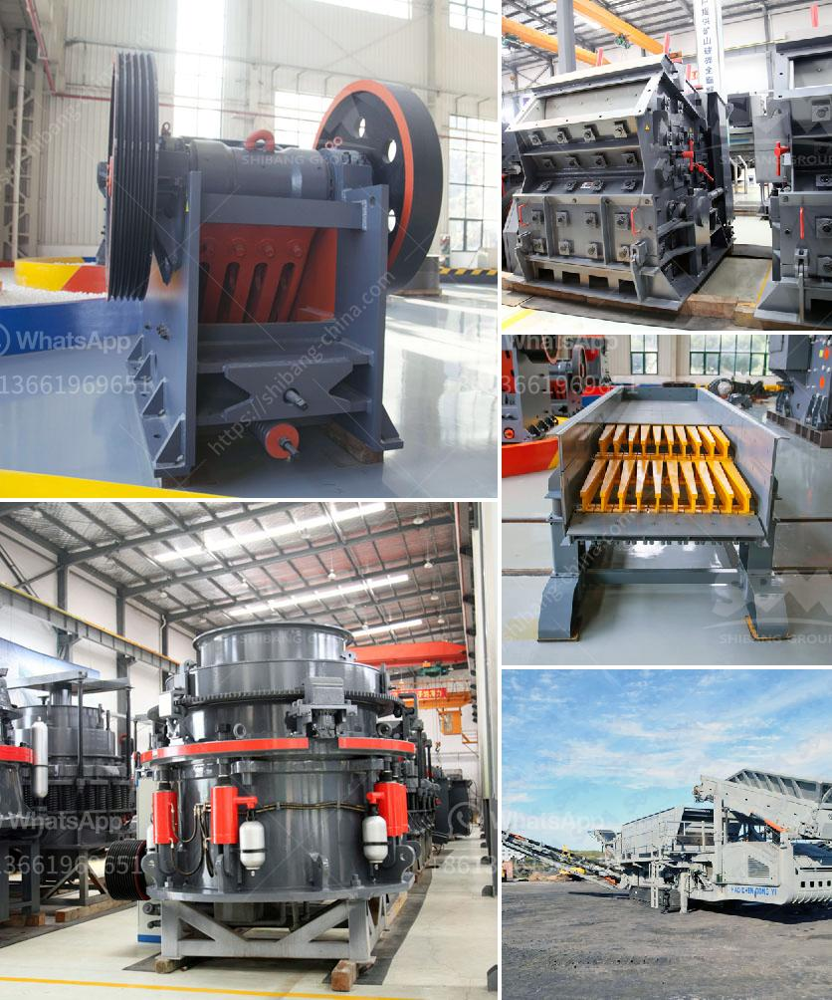

<h3>harga grinder mill</h3>
When it comes to preparing food at home, having the right tools can make all the difference. One essential tool for any kitchen is a grinder mill, which allows you to grind and pulverize spices, herbs, or coffee beans with ease. However, finding a quality grinder mill at an affordable price can be a challenge. Enter the harga grinder mill, a budget-friendly option that is gaining popularity among home cooks.

The term "harga" originates from Indonesian, where it means "price." Hence, a harga grinder mill refers to a grinder mill that offers excellent value for its price. With a market flooded with options, it is crucial to select a grinder mill that not only fits your budget but also meets your grinding needs.

When exploring harga grinder mills, you will find a wide range of options, both in terms of price and features. Many models fall within the 100-300 dollar price range, making them accessible to a broad spectrum of consumers. These grinders typically have durable stainless-steel or ceramic blades, ensuring consistent grinding results.

One of the advantages of a harga grinder mill is its versatility. With adjustable settings, you can easily achieve your desired coarseness or fineness. Whether you need a coarse grind for a robust rub or a fine powder for a delicate spice mix, a harga grinder mill can cater to your needs.

Additionally, many harga grinder mills come with extra features, such as removable grinding cups and lids for convenient storage or rubberized grips for enhanced durability. These additional features add value to your purchase and make the grinding experience even more enjoyable.

When considering a harga grinder mill, it is essential to read customer reviews and conduct thorough research to ensure you select a reliable and reputable brand. Look for a grinder mill that has a sturdy construction and is backed by positive customer feedback.

In conclusion, a harga grinder mill is an affordable option that allows home cooks to enjoy the benefits of freshly ground spices, herbs, or coffee without breaking the bank. With a range of options available at prices within the 100-300 dollar range, finding the perfect grinder mill for your kitchen has never been more accessible. So, elevate your culinary creations and invest in a harga grinder mill today!
<h3>Contact us</h3><ul><li><strong>Whatsapp:&nbsp;<a href="https://wa.me/8613661969651">+8613661969651</a></strong></li><li><a href="https://swt.shibang-china.com/?git&amp;zhl&amp;harga grinder mill"><strong>Online Service(chat now)</strong></a></li></ul><h3>Related</h3><ul><li><a href='checklist for heavy stone crusher machine.md'>checklist for heavy stone crusher machine</a></li><li><a href='stone crushing plant manufacturers in.md'>stone crushing plant manufacturers in</a></li><li><a href='grinder mill powder singapore.md'>grinder mill powder singapore</a></li><li><a href='barite powder manufacturing plant.md'>barite powder manufacturing plant</a></li><li><a href='gold wash plant at south africa gold mine.md'>gold wash plant at south africa gold mine</a></li></ul>