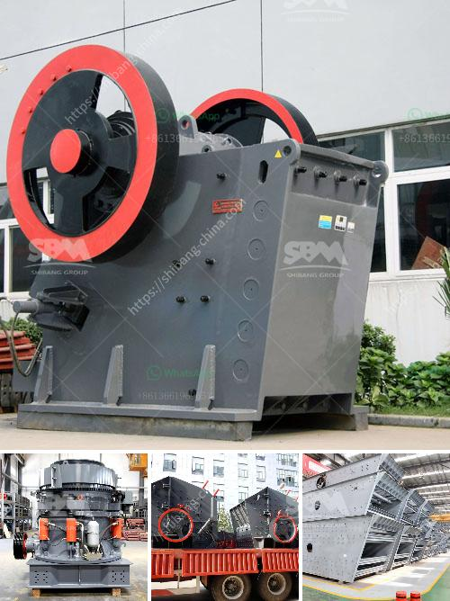

<h3>harga mesin ball mill</h3>
A ball mill, also known as a grinder, is a versatile tool that is widely used in various industries to grind raw materials into a fine powder. As the name suggests, this equipment works by utilizing balls to crush the material. It is commonly used in the mining and construction industries, where it can handle large amounts of material efficiently. In this article, we will discuss harga mesin ball mill, its various uses, and why it is considered an essential tool.

The primary purpose of a ball mill is to grind materials into a fine powder. This process is achieved by feeding the material into the mill at a steady rate, where it is then crushed by the rotating balls. The fine powder produced by the ball mill can be used in various applications, such as cement production, paint, and coatings, ceramics, and many others. It is an essential tool in the manufacturing process of these products, as it allows for precise control over the particle size and consistency.

One of the advantages of using a ball mill is its ability to work with different types of materials. It can grind both wet and dry materials, making it suitable for a wide range of applications. Additionally, it can be used to grind materials of varying hardness, from soft to hard. This versatility makes the ball mill a preferred choice for industries that require grinding of different types of materials.

When choosing a mesin ball mill, one of the key considerations is its harga, or the price. The price of a ball mill can vary depending on several factors, including its size, capacity, and features. Generally, larger ball mills with higher capacity and more advanced features tend to be more expensive. However, it is important to assess the specific needs of your application and choose a ball mill that strikes the right balance between price and performance.

In addition to the harga, it is also essential to consider the quality and reliability of the ball mill. Investing in a high-quality machine can help ensure its durability and longevity, reducing the risk of breakdowns and the need for frequent repairs or replacements. This can result in long-term cost savings and increased productivity.

To find the best harga mesin ball mill, it is advisable to research various suppliers and compare their offerings. Read customer reviews and testimonials to gauge the satisfaction levels of previous buyers. Additionally, consider consulting with industry experts or professionals who have experience using ball mills to get their recommendations.

In conclusion, harga mesin ball mill plays a crucial role in various industries, making it an essential tool for grinding materials. Its ability to work with different types of materials and grind them into a fine powder gives it versatility and widespread use. When choosing a ball mill, considering factors such as harga, size, capacity, and quality is essential to ensure optimal performance and value for money. By selecting the right ball mill, businesses can enhance their manufacturing processes and achieve superior results.
<h3>Contact us</h3><ul><li><strong>Whatsapp:&nbsp;<a href="https://wa.me/8613661969651">+8613661969651</a></strong></li><li><a href="https://swt.shibang-china.com/?git&amp;zhl&amp;harga mesin ball mill"><strong>Online Service(chat now)</strong></a></li></ul><h3>Related</h3><ul><li><a href='cement plant machinery supplier in korea.md'>cement plant machinery supplier in korea</a></li><li><a href='talc powder mill suppliers in china.md'>talc powder mill suppliers in china</a></li><li><a href='crusher stone for sale gauteng.md'>crusher stone for sale gauteng</a></li><li><a href='manganese processing plant in south africa.md'>manganese processing plant in south africa</a></li><li><a href='coal conveyor problem.md'>coal conveyor problem</a></li></ul>