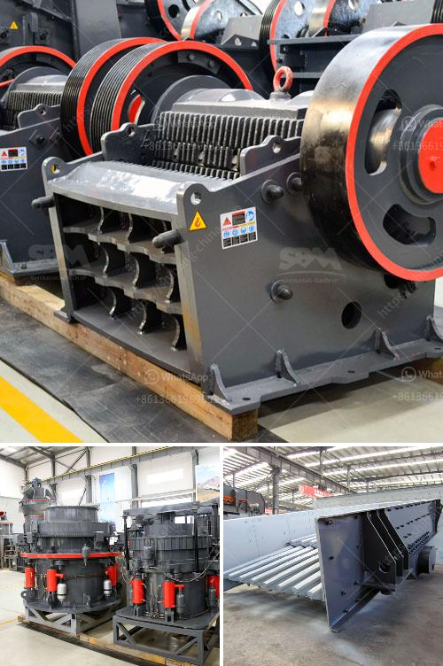

<h3>harga mesin pemecah batu kapasitas satu ton</h3>
Mesin pemecah batu adalah alat yang digunakan untuk memecah batu menjadi ukuran yang lebih kecil, yang biasanya digunakan dalam industri konstruksi dan pertambangan. Harga mesin pemecah batu kapasitas satu ton menjadi perhatian bagi para pengusaha yang ingin membeli mesin tersebut.

Sebagai alat yang penting dalam proses produksi batu pecah, harga mesin pemecah batu kapasitas satu ton dapat bervariasi tergantung pada beberapa faktor. Pertama adalah bahan yang digunakan dalam pembuatan mesin tersebut. Mesin pemecah batu terbuat dari material yang kuat dan tahan lama agar mampu menghancurkan batu dengan kekuatan yang besar. Kualitas material ini tentu mempengaruhi harga mesin.

Kemudian, kapasitas produksi mesin juga menjadi faktor yang menentukan harga. Mesin dengan kapasitas produksi satu ton per jam akan memiliki harga yang berbeda dengan mesin yang mampu menghasilkan tiga ton per jam. Semakin tinggi kapasitas produksi, umumnya semakin tinggi pula harga mesin pemecah batu tersebut.

Faktor lain yang mempengaruhi harga mesin pemecah batu adalah merek dan fitur yang disediakan. Mesin dengan merek terkenal seringkali memiliki harga yang lebih tinggi, karena produk tersebut dianggap memiliki kualitas yang lebih baik dan terjamin. Selain itu, mesin dengan fitur tambahan seperti sistem pengaturan ukuran batu yang lebih presisi atau desain yang lebih ergonomis juga dapat mempengaruhi harga mesin.

Untuk mendapatkan harga mesin pemecah batu kapasitas satu ton yang sesuai dengan anggaran, sebaiknya melakukan penelitian terlebih dahulu. Banyak perusahaan yang menjual mesin pemecah batu dengan berbagai pilihan harga. Mencari referensi dan membandingkan harga dari beberapa penjual dapat membantu menemukan mesin yang sesuai dengan kebutuhan dan anggaran yang dimiliki.

Harga mesin pemecah batu kapasitas satu ton merupakan informasi penting bagi para pengusaha yang ingin memulai usaha atau memperluas produksi. Penting untuk memperhatikan faktor-faktor yang mempengaruhi harga seperti bahan, kapasitas produksi, merek, dan fitur yang disediakan. Dengan melakukan penelitian dan membandingkan harga, diharapkan dapat memperoleh mesin yang berkualitas dengan harga yang sesuai.
<h3>Contact us</h3><ul><li><strong>Whatsapp:&nbsp;<a href="https://wa.me/8613661969651">+8613661969651</a></strong></li><li><a href="https://swt.shibang-china.com/?git&amp;zhl&amp;harga mesin pemecah batu kapasitas satu ton"><strong>Online Service(chat now)</strong></a></li></ul><h3>Related</h3><ul><li><a href='business plan for stone grinding in ethiopia.md'>business plan for stone grinding in ethiopia</a></li><li><a href='hp series cone crusher.md'>hp series cone crusher</a></li><li><a href='vertical mill of a cement company.md'>vertical mill of a cement company</a></li><li><a href='crushing plant aggregates in south africa.md'>crushing plant aggregates in south africa</a></li><li><a href='gyratory crusher copper mine.md'>gyratory crusher copper mine</a></li></ul>