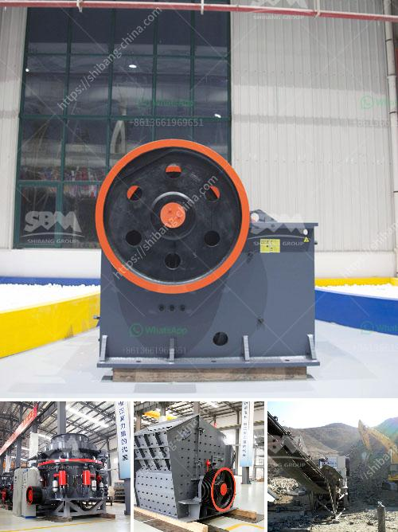

<h3>harga powerful crusher machine</h3>
In today's fast-paced world, industries are constantly searching for efficient and effective machines to streamline their operations. One such machine that has gained tremendous popularity is the harga powerful crusher machine. This machine has revolutionized various sectors and has become a staple in many industries.

The harga powerful crusher machine is a cutting-edge piece of equipment that boasts remarkable strength and power. It is designed to quickly and effectively crush large volumes of material, making it ideal for industries that deal with heavy-duty tasks. From mining to construction, this machine is a game-changer in terms of productivity and efficiency.

One of the standout features of the harga powerful crusher machine is its robust construction. It is built to withstand the most demanding conditions, ensuring its longevity and reliability. Whether it is crushing rocks, concrete, or other materials, this machine can handle it all without faltering. Its powerful motor and sturdy frame allow it to tackle even the toughest jobs with ease.

Another significant advantage of the harga powerful crusher machine is its versatility. It can adapt to various applications, making it suitable for a wide range of industries. Whether it is breaking down large rocks into smaller pieces or pulverizing concrete into reusable materials, this machine can do it all. Its adjustable settings and interchangeable blades allow it to cater to different requirements, providing optimal solutions for every task.

One of the key benefits of investing in the harga powerful crusher machine is its impact on productivity. With its incredible speed, efficiency, and unmatched strength, this machine can significantly enhance the workflow of any industry. It can crush large volumes of material within a short period, saving both time and manpower. This increased productivity translates into greater profits and a competitive edge for businesses.

Additionally, the harga powerful crusher machine is designed with safety in mind. It features various safety mechanisms to ensure the well-being of workers and minimize the risk of accidents. From emergency stop buttons to protective covers, this machine is equipped with all the necessary precautions to ensure a secure working environment.

Furthermore, the harga powerful crusher machine is also environmentally friendly. It incorporates advanced technology that minimizes noise pollution and reduces dust emissions. This not only benefits workers' health but also aligns with sustainable practices, making it a responsible choice for industries.

In conclusion, the harga powerful crusher machine has revolutionized multiple industries by offering an efficient, versatile, and reliable solution. Its robust construction, versatility, and impact on productivity make it a must-have for any industry that deals with heavy-duty tasks. With its numerous benefits, including safety features and environmental friendliness, this machine sets a new standard in the realm of crusher machines. Invest in the harga powerful crusher machine today and witness the immense transformation it brings to your industry.
<h3>Contact us</h3><ul><li><strong>Whatsapp:&nbsp;<a href="https://wa.me/8613661969651">+8613661969651</a></strong></li><li><a href="https://swt.shibang-china.com/?git&amp;zhl&amp;harga powerful crusher machine"><strong>Online Service(chat now)</strong></a></li></ul><h3>Related</h3><ul><li><a href='crushers of crushers.md'>crushers of crushers</a></li><li><a href='price ball mill 40tph.md'>price ball mill 40tph</a></li><li><a href='granite crusher for sale.md'>granite crusher for sale</a></li><li><a href='grinder mill specification.md'>grinder mill specification</a></li><li><a href='grinding mill material.md'>grinding mill material</a></li></ul>