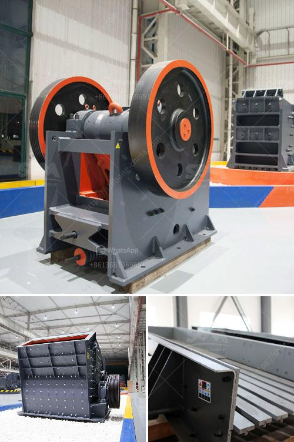

<h3>harga stone crusher 250 ton jam indonesia</h3>
Harga stone crusher 250 ton jam Indonesia is the perfect combination of modern technology and production practices more in line with the needs of our customers automated production brings more revenue. Stone crushers have played a pivotal role in the history of America since its creation in the mid-1800s. Since then millions of tons of stone have been crushed to make everything from houses to roads and everything in between. The first stone crusher was invented by Eli Whitney Blake, the nephew of Eli Whitney, the creator of the cotton gin. After five years, Blake's stone crusher roared to life, thanks in part to a challenge laid before him by the town of Westville, Conn. The purpose was to put down a rock surface on the roads so wagons wouldn't get stuck in the mud. Blake went further with the design and developed it for the railroads to create ballast. In the 19th century, rock crushers proved valuable in laying roads to a growing nation. On top of that, they also were used to extract precious metals out of giant blocks of stone. "Rock crushing is driven from a population standpoint because it's the population that's demanding the aggregate. Every type of aggregate that's consumed, people consume it every day of the week, and they'll never even know it. It's in their roads or in their showers, throughout the building, all the cement that's used in homes and buildings. Industrial uses include: ore extraction in mining operations, rock crushing can be found in construction sites all around the world. Rock crushers are also used in mining operations. Companies like CEMCO specialize in designing and building equipment that saves energy and reduces operational costs. The days of expensive mining crushing equipment are gone forever. Harga stone crusher 250 ton jam Indonesia has achieved an absolutely breakthrough in technology and performance with the assistance of nationwide sales network and skilled service personnel. Nowadays, there are several types of stone crushers that can be used, including jaw crusher, impact crusher, cone crusher and hammer mill. Although they are working with the same material, the specific design of each type of machine allows for greatly differing capabilities. For example, hammer mills and jaw crushers both use compression to break up chunks of rock, while cone crushers use a spinning rotor to hurl smaller rocks against an anvil. A jaw crusher can crush large piece of limestone materials, and the cone crusher can process smaller particles. One of my colleagues went to the installation site. This is the photo she took, seen from the production base, the project site is very large. In 2020, DOD developed a perfect combination of mobility, flexibility and conservativeness, reducing operation costs. DOD is a large-scale manufacturer of rock and stone crushing equipment, providing rock crushing equipment and related services for the infrastructure of roads, railways, buildings and other large projects.

In conclusion, harga stone crusher 250 ton jam Indonesia provides efficient and reliable ways to meet the crushing needs of a variety of industries. For construction purposes, there are many different sizes of stone crushers and machines available. Just as an example, jaw crusher usually tracks in anywhere from 10 to 60 tons per hour depending on the plant size and output required. All of our products are with CE approved in compliance with the worldwide machinery directive. We are located in the United States, and service North America, Europe, and Africa. All of our machines are backed by an effective after-sales support team and spare parts service.
<h3>Contact us</h3><ul><li><strong>Whatsapp:&nbsp;<a href="https://wa.me/8613661969651">+8613661969651</a></strong></li><li><a href="https://swt.shibang-china.com/?git&amp;zhl&amp;harga stone crusher 250 ton jam indonesia"><strong>Online Service(chat now)</strong></a></li></ul><h3>Related</h3><ul><li><a href='m sand machine in tamil nadu.md'>m sand machine in tamil nadu</a></li><li><a href='german jaw crusher manufacturers.md'>german jaw crusher manufacturers</a></li><li><a href='granite quarry plants.md'>granite quarry plants</a></li><li><a href='pakistan silica sand washing plant.md'>pakistan silica sand washing plant</a></li><li><a href='vertical roller mill price.md'>vertical roller mill price</a></li></ul>