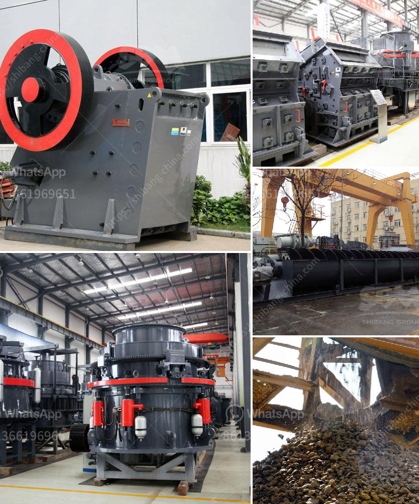

<h3>high capacity stone hammer crusher manufacturer</h3>
When it comes to selecting a stone hammer crusher machine for your mining or quarrying project, there are a few important criteria you need to consider. Finding the right machine and manufacturer is crucial for the overall success of your operation. Today, we will discuss the high capacity stone hammer crusher and its manufacturing process.

A high-capacity stone hammer crusher is an investment that can be used for primary and secondary crushing operations. Massive ore in the raw material is crushed into smaller pieces by means of hammerhead impact. This is highly efficient and most commonly used in quarries, mines, and cement plants. In addition to cement production, this hammer crusher machine can also be used in other industries such as metallurgy, mining, chemical, electric power, highway construction, and more.

Choosing the right high capacity stone hammer crusher manufacturer is an important step towards achieving the maximum production capacity of the machine. Different manufacturers provide different configurations of hammer crush machines to meet various crushing needs. Consequently, it is vital to choose the correct hammer crusher model, according to the required specifications.

A high capacity stone hammer crusher is designed with advanced technology and optimized design for increased yield and performance. The crushing process works efficiently without any specific limitations on raw material hardness or moisture content.

1. High crushing ratio: The output ratio of hammer crusher is very large, generally around 10-25. This high yield makes the hammer crusher a popular choice for primary crushing operations.

2. Adjustable output size: As the hammer crusher has adjustable size of discharge opening, it can regulate the output size by adjusting the rotor speed or the distance between the hammer and the impact plate. This feature allows for customization to meet specific project requirements.

3. Energy-saving: The high capacity stone hammer crusher is designed to be energy-efficient, reducing operating costs and saving energy consumption.

4. Durable construction: The hammer crusher is built with durable materials and advanced manufacturing techniques, ensuring long-lasting performance even under harsh conditions.

Choosing a trusted and reliable high capacity stone hammer crusher manufacturer is crucial for the success of your mining or quarrying project. A good manufacturer will provide you with a high-quality machine that meets your requirements and offers excellent after-sales service. Some key factors to consider when selecting a manufacturer include:

1. Reputation: Research the manufacturer's reputation in the industry to ensure their reliability and credibility.

2. Experience: Look for a manufacturer with extensive experience in the field of stone crushing equipment.

3. Quality: Check if the manufacturer has relevant certifications to ensure the quality of their products.

4. Service and support: Consider the availability of after-sales service and support, including spare parts availability and technical assistance.

In conclusion, when it comes to high-capacity stone hammer crusher machines, choosing the right manufacturer is essential. A high-quality and efficient machine will ensure optimal performance and productivity for your mining or quarrying operation. Consider the characteristics and features of the hammer crusher, as well as the reputation and experience of the manufacturer, to make an informed decision that aligns with your project requirements.
<h3>Contact us</h3><ul><li><strong>Whatsapp:&nbsp;<a href="https://wa.me/8613661969651">+8613661969651</a></strong></li><li><a href="https://swt.shibang-china.com/?git&amp;zhl&amp;high capacity stone hammer crusher manufacturer"><strong>Online Service(chat now)</strong></a></li></ul><h3>Related</h3><ul><li><a href='primary stone crusher.md'>primary stone crusher</a></li><li><a href='grinding mill machine cost price south africa.md'>grinding mill machine cost price south africa</a></li><li><a href='slag processing plant manufacturers in chile.md'>slag processing plant manufacturers in chile</a></li><li><a href='manganese wash plant zambia.md'>manganese wash plant zambia</a></li><li><a href='ball mill specification limestone grinding.md'>ball mill specification limestone grinding</a></li></ul>