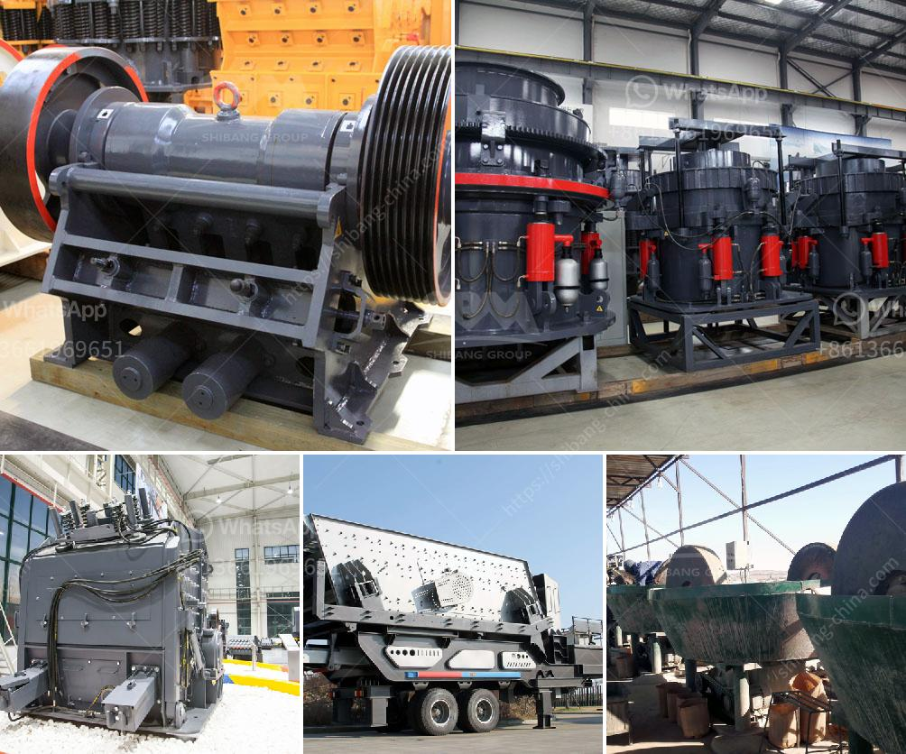

<h3>high energy ball mill price</h3>
With increasing global industrialization, the demand for scientific research in material development is on the rise. Innovative materials have become the backbone of numerous sectors, including pharmaceuticals, electronics, aerospace, and energy. This has led to the emergence of cutting-edge technologies that can efficiently produce and synthesize advanced materials. One such technology is the high energy ball mill.

A high energy ball mill is a type of grinder used to grind materials into extremely fine powder for use in various industrial applications. It is capable of producing powders in the nanometer range and is suitable for continuous grinding and mechanical alloying. The high energy ball mill price can vary depending on the model, capacity, and production output, among other factors.

A high energy ball mill is a great investment for any laboratory or research facility. It can produce a wide range of particle sizes, from coarse powders to fine powders, and can easily be tailored to specific applications. The high energy ball mill has been proven to be effective in producing nano materials, achieving remarkable properties in terms of strength, hardness, and conductivity.

One of the main advantages of using a high energy ball mill is its ability to produce materials at a significantly lower cost compared to other technologies. The high energy ball mill price is relatively low, making it an attractive option for laboratories and small-scale manufacturing plants.

Furthermore, the high energy ball mill price is very competitive compared to other technologies that achieve similar results. A high energy ball mill can be used to achieve similar results at a fraction of the cost. This makes it a cost-effective option for material research.

In addition to its cost-effectiveness, a high energy ball mill is also environmentally friendly and energy efficient. The grinding process in a high energy ball mill is considerably faster than in conventional ball mills, resulting in energy savings of up to 40%. The high energy ball mill price is also a positive factor for its green properties. A sustainable alternative to the conventional ball mill, these innovative mills not only reduce electricity consumption but also minimize waste production.

The high energy ball mill market is projected to grow at a significant rate in the coming years. The demand for high energy ball mills is increasing due to the growing need for nanotechnology applications and advancements in materials science. As researchers strive to develop materials with enhanced properties, the demand for high energy ball mills is expected to rise further.

In conclusion, high energy ball mills are a promising and revolutionary technology for material research. They offer numerous advantages, including cost-effectiveness, environmental friendliness, and energy efficiency. The high energy ball mill price is attractive for laboratories and small-scale manufacturing plants, making it a worthwhile investment for material research and development. As this technology continues to advance, we can expect to see wider applications of high energy ball mills in various sectors, revolutionizing the way we produce and develop advanced materials.
<h3>Contact us</h3><ul><li><strong>Whatsapp:&nbsp;<a href="https://wa.me/8613661969651">+8613661969651</a></strong></li><li><a href="https://swt.shibang-china.com/?git&amp;zhl&amp;high energy ball mill price"><strong>Online Service(chat now)</strong></a></li></ul><h3>Related</h3><ul><li><a href='hydro classifier silica sand.md'>hydro classifier silica sand</a></li><li><a href='self healing process of limestone.md'>self healing process of limestone</a></li><li><a href='mobile coal washing plant investment.md'>mobile coal washing plant investment</a></li><li><a href='proposal pabrik stone crusher.md'>proposal pabrik stone crusher</a></li><li><a href='gypsum vibrating screen.md'>gypsum vibrating screen</a></li></ul>