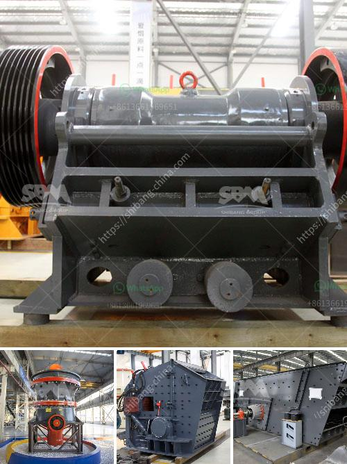

<h3>high pressure micro powder grinder in india</h3>
The development of India's industrial sector has led to an increased demand for high-quality and efficient machinery. One such machine that has gained popularity in recent years is the high-pressure micro powder grinder.

The high-pressure micro powder grinder is a new type of grinding equipment, which is developed by our company's experts based on the experience of production and development for many years in the industry. It is the ideal equipment for superfine milling industry, which integrates crushing, grinding, drying, grading and conveying.

One of the key advantages of the high-pressure micro powder grinder is its ability to produce powder with a particle size ranging from 80 to 800 mesh. This makes it suitable for a wide range of applications, including the production of paints, coatings, inks, pigments, dyes, cosmetics, and pharmaceuticals. In addition, the grinder can also be used for the production of building materials, chemicals, and mining-related industries.

In terms of performance, the high-pressure micro powder grinder is known for its high efficiency and low power consumption. It uses a unique working principle, where the grinding roller is tightly pressed on the grinding ring under the action of high-pressure springs. This ensures a stable and consistent grinding pressure, resulting in a more efficient and uniform grinding process. Furthermore, the machine also has a built-in air blower, which can effectively eliminate dust and improve the overall working environment.

Another advantage of the high-pressure micro powder grinder is its compact design and easy operation. The grinder is equipped with a control system that allows users to adjust the fineness of the powder according to their specific requirements. It also has a built-in classifier, which can control the particle size distribution of the final product. Moreover, the grinder is designed with a relatively small footprint, making it suitable for use in small and medium-sized workshops.

In India, the high-pressure micro powder grinder has gained significant popularity in various industries. Its ability to produce high-quality and uniform powder has made it a preferred choice among manufacturers. The machine not only improves the overall productivity but also reduces production costs, ultimately leading to higher profits for businesses.

In conclusion, the high-pressure micro powder grinder is an efficient and versatile grinding machine that has found widespread use in India's industrial sector. Its ability to produce high-quality powder in various industries has made it a preferred choice among manufacturers. With its compact design, easy operation, and low power consumption, the grinder offers a cost-effective solution for businesses looking to improve their grinding processes. As India continues to grow its industrial sector, the demand for high-pressure micro powder grinders is expected to rise in the coming years.
<h3>Contact us</h3><ul><li><strong>Whatsapp:&nbsp;<a href="https://wa.me/8613661969651">+8613661969651</a></strong></li><li><a href="https://swt.shibang-china.com/?git&amp;zhl&amp;high pressure micro powder grinder in india"><strong>Online Service(chat now)</strong></a></li></ul><h3>Related</h3><ul><li><a href='grinding equipment raymond mill.md'>grinding equipment raymond mill</a></li><li><a href='vertical grinding machine for marble.md'>vertical grinding machine for marble</a></li><li><a href='price of mobile crushing plant.md'>price of mobile crushing plant</a></li><li><a href='ball mill unloading system in india.md'>ball mill unloading system in india</a></li><li><a href='iron ore melting plant supplier china.md'>iron ore melting plant supplier china</a></li></ul>