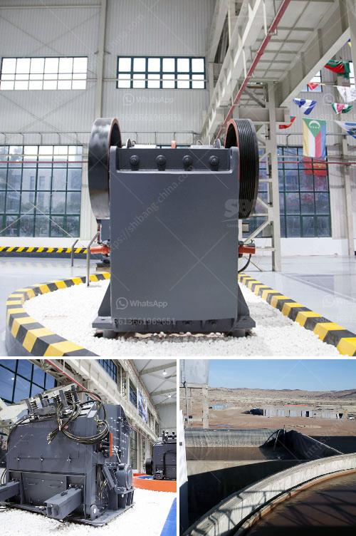

<h3>horizontal shaft impact crusher</h3>
The horizontal shaft impact crusher is a type of crusher that operates in a horizontal plane. This machine is sometimes called a "transverse crusher." To distinguish it from the vertical shaft impact crusher, the following analysis of the selection of the machine will focus on the horizontal shaft impact crusher.

The horizontal shaft impact crusher is a versatile machine that can operate in any crushing application. The machine is designed with a rugged rotor, adjustable impact bars, semi-automatic or fully hydraulic curtain adjustment, and a variety of blow bar configurations. These features result in a machine that is capable of producing a wide range of aggregate sizes with excellent particle shape.

One of the key advantages of the horizontal shaft impact crusher is its simplicity. The machine consists of a feed hopper, a rotor, and a breaker plate. Material is fed into the hopper and then directed to the rotor where it is accelerated and thrown against the breaker plate. This impact causes the material to break and separate, resulting in a product that is ready for further processing.

The horizontal shaft impact crusher is commonly used for both primary and secondary crushing applications. It can also be used as a tertiary crusher in some cases. The machine is ideal for producing a high-quality end product, especially in applications where shape matters, such as the production of concrete aggregates.

Another advantage of the horizontal shaft impact crusher is its ability to handle wet or sticky materials. The machine's design and unique features allow it to process wet or sticky materials without clogging, reducing downtime and increasing productivity.

In conclusion, the horizontal shaft impact crusher is a versatile and efficient machine that is widely used in the mining, quarrying, and recycling industries. Its simple design, rugged construction, and ability to handle wet or sticky materials make it an excellent choice for any crushing application. Whether used as a primary, secondary, or tertiary crusher, the horizontal shaft impact crusher delivers high-quality, well-shaped end products.
<h3>Contact us</h3><ul><li><strong>Whatsapp:&nbsp;<a href="https://wa.me/8613661969651">+8613661969651</a></strong></li><li><a href="https://swt.shibang-china.com/?git&amp;zhl&amp;horizontal shaft impact crusher"><strong>Online Service(chat now)</strong></a></li></ul><h3>Related</h3><ul><li><a href='rock crushing machine for concrete use.md'>rock crushing machine for concrete use</a></li><li><a href='how to improve grinding efficiency of a mill.md'>how to improve grinding efficiency of a mill</a></li><li><a href='chinese gypsum production line equipment.md'>chinese gypsum production line equipment</a></li><li><a href='list of gold refineries companies in uae.md'>list of gold refineries companies in uae</a></li><li><a href='limestone impact crusher wobbler.md'>limestone impact crusher wobbler</a></li></ul>