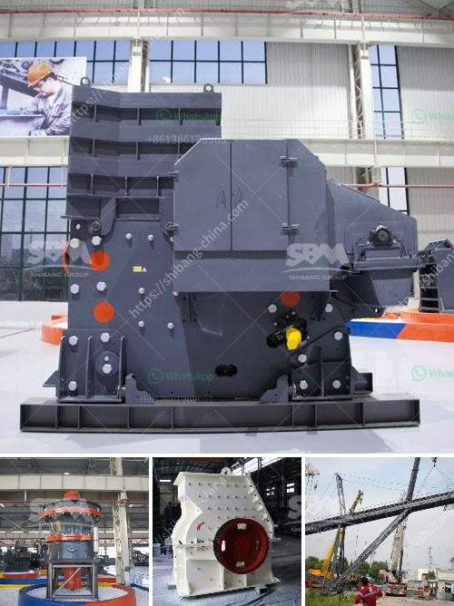

<h3>how many kg in 1 cubic feet of 20mm crusher stone</h3>
When it comes to construction, people always look for the best materials that can ensure strength and durability. One of the most widely used materials in the construction industry is 20mm crusher stone. This stone is classified as granite, with a mix of medium to large particles measuring around 20mm in size. It is utilized in various construction projects, including roadways, driveways, and building foundations.

To understand the weight of 20mm crusher stone, we need to first calculate the volume of one cubic foot. A cubic foot is a measurement of volume, while a kilogram is a unit of weight. The two cannot be directly converted without knowing the density of the substance in question. In this case, we are trying to determine the weight of 20mm crusher stone aggregate, which is a combination of small stones and fine dust particles.

To accurately calculate the weight of the crusher stone, we need to know the density of the stone. This is done by dividing the mass (weight) by the volume. The density varies depending on the type of stone used, but on average, a 20mm crusher stone weighs around 1.8 to 2.2 kg per cubic foot.

Using this average density, we can then multiply the volume in cubic feet by the density in kilograms per cubic foot to obtain the weight in kilograms. For example, if we have a cubic foot of 20mm crusher stone, the calculation would be as follows:

Let's assume we have one cubic foot of 20mm crusher stone. Substituting it into the equation, we get:

It is important to note that the weight of the stone may vary slightly depending on its water content and the amount of dust present. These factors can affect the actual density of the stone, resulting in slight variations in weight.

20mm crusher stone has numerous applications in the construction industry due to its durability and versatility. It is commonly used as a base material for roadways, providing stability and support for vehicles passing over it. Additionally, it is also frequently used for driveway installations, where its compacted nature ensures a stable surface.

In conclusion, the weight of one cubic foot of 20mm crusher stone can range from 1.8 to 2.2 kilograms. Its density is dependent on the specific type of stone and its composition. Understanding the weight of this material is crucial in construction projects, as it helps ensure the structure's stability and durability. Proper calculations are necessary to ensure accurate estimations and efficient use of materials in the construction industry.
<h3>Contact us</h3><ul><li><strong>Whatsapp:&nbsp;<a href="https://wa.me/8613661969651">+8613661969651</a></strong></li><li><a href="https://swt.shibang-china.com/?git&amp;zhl&amp;how many kg in 1 cubic feet of 20mm crusher stone"><strong>Online Service(chat now)</strong></a></li></ul><h3>Related</h3><ul><li><a href='gypsum plant equipment catalogue.md'>gypsum plant equipment catalogue</a></li><li><a href='dolomite powder mill manufacturing process.md'>dolomite powder mill manufacturing process</a></li><li><a href='crushers for recycling machine uae.md'>crushers for recycling machine uae</a></li><li><a href='river pebble crusher supplier.md'>river pebble crusher supplier</a></li><li><a href='bauxite ore business plan pdf.md'>bauxite ore business plan pdf</a></li></ul>