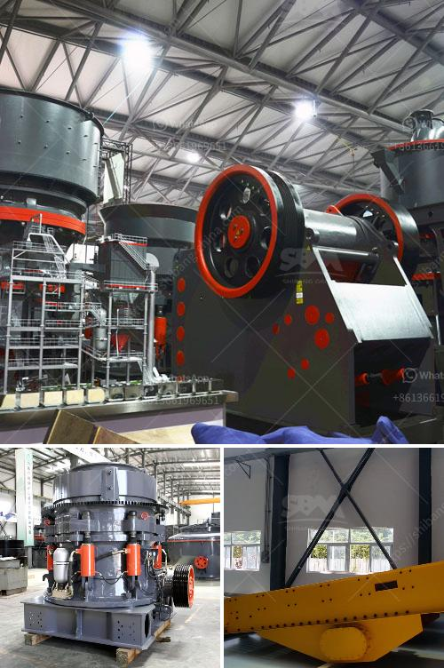

<h3>how much can a quarry plant cost</h3>
A quarry plant refers to the machinery and equipment used for excavation, mining, and processing of natural resources such as rocks, stones, sand, and gravel to produce aggregate materials for construction purposes. The cost of setting up a quarry plant can vary greatly depending on the specific resources and geographical location, but it is essential for operators to consider various factors that will affect the total expenditure involved. 

First and foremost, the cost of land and site preparation cannot be overlooked. Acquiring suitable land for a quarry plant can be a significant expense, particularly if the site is strategically located near high-demand markets or transportation routes. Clearing and leveling the area, as well as complying with environmental regulations, may further add to the expenses.

The second factor that impacts the cost is the scale and type of machinery required. The size of the operation and the specific materials being extracted will determine the machinery needed, such as crushers, screens, conveyors, and storage bins. Additionally, the type of processing methods used, such as crushing, grinding, or washing, will also influence equipment costs. High-quality, advanced machinery often comes at a higher price, but it can also enhance productivity, efficiency, and quality of the final products.

In addition to machinery, energy supply and consumption are crucial considerations for cost estimation. Quarry plants consume significant amounts of electricity, particularly during processing operations. Therefore, the cost of electricity and the availability of a reliable power source should be carefully assessed. Introducing energy-saving technologies, such as utilizing renewable energy sources or implementing energy-efficient systems, can help reduce long-term energy expenses.

Labor costs also contribute significantly to the overall expenditure. Skilled employees, such as operators, mechanics, and managers, are essential for the successful functioning of a quarry plant. Salaries, benefits, training, and necessary safety measures should be factored in when calculating the labor costs.

Furthermore, ongoing maintenance and repair expenses need to be taken into account. Routine maintenance of the machinery and equipment, as well as periodic replacement of worn-out components, are critical to ensure operational efficiency and minimize downtime. Investing in a regular maintenance program can help prevent costly breakdowns and prolong the lifespan of machinery.

Last but not least, regulatory compliance is a cost factor that should not be overlooked. Quarry plants are subject to a range of environmental, health, and safety regulations. Adhering to these regulations may involve expenses related to environmental impact assessments, acquiring permits, implementing erosion control measures, and maintaining appropriate waste management practices.

In conclusion, estimating the cost of setting up a quarry plant is a complex process that requires careful consideration of various factors. Land acquisition, machinery selection, energy supply, labor costs, ongoing maintenance, and regulatory compliance are all key elements influencing total expenditure. Each quarry operation is unique, and costs can vary significantly depending on location, resource availability, and site-specific requirements. To accurately determine the cost, it is recommended to consult industry professionals and conduct a detailed feasibility study.
<h3>Contact us</h3><ul><li><strong>Whatsapp:&nbsp;<a href="https://wa.me/8613661969651">+8613661969651</a></strong></li><li><a href="https://swt.shibang-china.com/?git&amp;zhl&amp;how much can a quarry plant cost"><strong>Online Service(chat now)</strong></a></li></ul><h3>Related</h3><ul><li><a href='mobile crusher for rent in uae.md'>mobile crusher for rent in uae</a></li><li><a href='quarry crusher equipment costs.md'>quarry crusher equipment costs</a></li><li><a href='impact crusher saudi arabia.md'>impact crusher saudi arabia</a></li><li><a href='mobile jaw crusher for sale.md'>mobile jaw crusher for sale</a></li><li><a href='industrial gypsum rotary kiln.md'>industrial gypsum rotary kiln</a></li></ul>