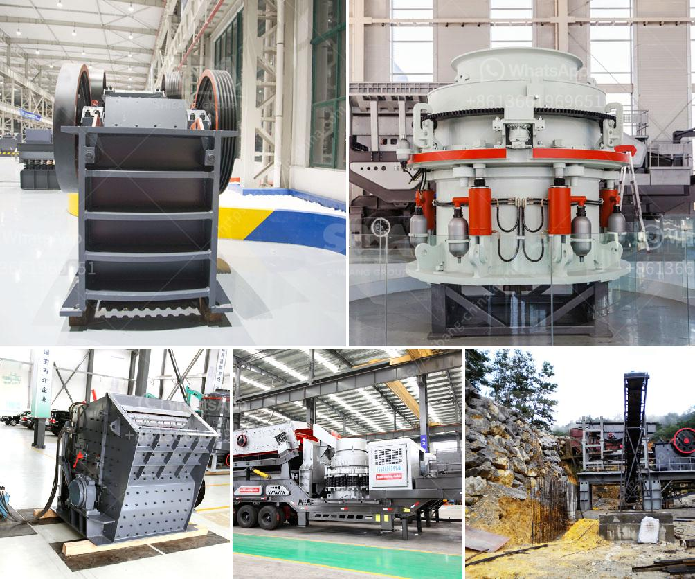

<h3>how much cost silicon quartz stone</h3>
Silicon quartz stone, also commonly known as engineered quartz or quartz composite, has gained immense popularity as a countertop material in recent years. It is lauded for its durability, aesthetics, and low maintenance requirements. However, before embarking on a kitchen or bathroom renovation project, it is essential to understand the cost implications of silicon quartz stone. In this article, we will delve into the factors that influence the price range for silicon quartz stone and provide an overview of the cost associated with this versatile material.

One of the main factors contributing to the cost of silicon quartz stone is the brand or manufacturer. Numerous companies produce and distribute quartz composite products, each with its pricing structure. Well-known brands tend to charge higher prices due to their reputation, commitment to high-quality materials, and advanced manufacturing processes. Conversely, lesser-known or generic brands might offer more affordable options without compromising on quality.

The size and thickness of the silicon quartz slab also play a crucial role in determining the cost. The larger the slab required, the higher the cost will be. Additionally, the thickness of the slab can vary, usually ranging from 1 to 3 centimeters. Thicker slabs tend to be more expensive due to the increased material usage and sturdiness provided.

Moreover, the color and design of silicon quartz stone heavily influence its price range. The more intricate and scarce the design, the higher the cost will be. In terms of color, basic and commonly available options are usually more affordable than rare or exotic shades. Customization options, such as incorporating specific pigments or patterns, can also increase the overall price of the silicon quartz stone.

Installation costs must also be considered when budgeting for silicon quartz stone. Hiring a professional installer is recommended to ensure that the material is correctly handled and fitted. Installation fees can vary depending on the complexity of the project, the location, and the installer's expertise. It is advisable to obtain multiple quotes from reputable installers to ensure a fair price and quality workmanship.

Considering all these factors, the price range for silicon quartz stone typically starts around $50 per square foot and can go up to $200 per square foot. This wide range is due to the various factors mentioned above, as well as local market dynamics and supply chain costs. It is crucial to keep in mind that additional expenses, such as edge detailing, cutouts for sinks or appliances, and backsplash installation, can further increase the overall cost.

Despite the varying price range, investing in silicon quartz stone can be economically viable in the long run. Its durability and resistance to stains, scratches, and heat make it a cost-effective choice. Unlike natural stones like granite or marble, quartz composite does not require regular sealing or special maintenance, minimizing ongoing expenses.

In conclusion, the cost of silicon quartz stone depends on several factors, including brand, size, thickness, color, design, and installation. It is essential to consider these factors, as well as personal preferences and budget constraints, when choosing quartz composite for your countertops or other applications. A thorough evaluation of these aspects will ensure that you make an informed decision, balancing quality, aesthetics, and cost-effectiveness.
<h3>Contact us</h3><ul><li><strong>Whatsapp:&nbsp;<a href="https://wa.me/8613661969651">+8613661969651</a></strong></li><li><a href="https://swt.shibang-china.com/?git&amp;zhl&amp;how much cost silicon quartz stone"><strong>Online Service(chat now)</strong></a></li></ul><h3>Related</h3><ul><li><a href='mobile crusher for salt.md'>mobile crusher for salt</a></li><li><a href='crushing and grinding equipment cost in ethiopia.md'>crushing and grinding equipment cost in ethiopia</a></li><li><a href='stone crusher dijual.md'>stone crusher dijual</a></li><li><a href='prices on cone crusher parts.md'>prices on cone crusher parts</a></li><li><a href='jaw crushers south africa.md'>jaw crushers south africa</a></li></ul>