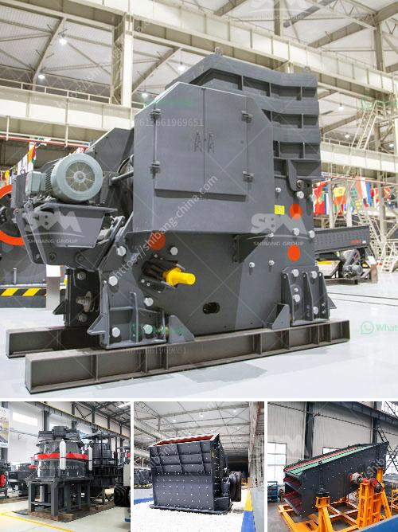

<h3>how much cost to buildton cement plant</h3>
The cement industry is one of the fastest-growing industries in the world, and the demand for cement is expected to continue to increase as urbanization and infrastructure development projects take center stage. For entrepreneurs looking to enter this lucrative field, building a cement plant can be an exciting and potentially profitable venture. However, it is crucial to understand the cost involved in establishing a cement plant as it can be a significant investment.

The cost of building a cement plant varies greatly depending on several factors, such as the location, the scale of plant, size of the production capacity, and the type of technology used. To give a rough idea of the cost, let's take a look at some of the basic requirements to set up a cement plant.

Land: The first and foremost requirement is a suitable piece of land. The cost of acquiring land can vary significantly depending on the location. For instance, land prices in urban areas tend to be higher compared to rural areas. Moreover, the size of the land required will depend on the scale of the plant and the production capacity. On average, the land cost accounts for around 10-15% of the total project cost.

Building and Infrastructure: Constructing the plant and setting up the necessary infrastructure is another crucial aspect to consider. The cost of building a cement plant's structures, including factories, offices, warehouses, and storage facilities, can vary based on the plant's size and capacity. Additionally, utilities such as water supply, electricity, and waste disposal systems must also be factored in.

Plant Machinery: Cement plants require various types of equipment and machinery to operate effectively. This includes kilns, crushers, mills, cement handling equipment, and other specialized machinery. The cost of plant machinery can be significant, as it forms a major portion of the overall project cost.

Labor and Manpower: Cement plants require a skilled workforce to operate efficiently. The cost of labor will depend on the market conditions and the region where the plant is situated. Additionally, the cost of recruiting and training employees must also be considered.

Regulatory Compliance: Compliance with environmental regulations and obtaining necessary permits and licenses can add complexities and costs to the project. It is vital to factor in all these costs and any additional expenses that may arise due to regulatory compliance.

Other miscellaneous costs: Apart from the major cost components mentioned above, there can be various ancillary costs involved, such as architect fees, legal and consultant fees, insurance, marketing, etc. These costs might seem small individually, but they can add up significantly over the course of the project.

As you can see, establishing a cement plant requires a substantial investment, and the cost can vary depending on various factors. Estimates suggest that the approximate cost to build a cement plant can range from $100 to $200 per tonne. However, these numbers are subjective and can vary considerably based on the nature of the project and the prevailing market conditions.

In conclusion, building a cement plant is a complex and capital-intensive endeavor. The cost involved in setting up a cement plant can be significant, and it is crucial to conduct a thorough feasibility study and cost analysis before embarking on such a venture. Careful planning and understanding of the market dynamics can help entrepreneurs in making informed decisions and ensure the success of their cement plant project.
<h3>Contact us</h3><ul><li><strong>Whatsapp:&nbsp;<a href="https://wa.me/8613661969651">+8613661969651</a></strong></li><li><a href="https://swt.shibang-china.com/?git&amp;zhl&amp;how much cost to buildton cement plant"><strong>Online Service(chat now)</strong></a></li></ul><h3>Related</h3><ul><li><a href='ball mill india suppliers.md'>ball mill india suppliers</a></li><li><a href='california rock crusher machine.md'>california rock crusher machine</a></li><li><a href='coal conveyor problem.md'>coal conveyor problem</a></li><li><a href='impactor crusher for sale south africa price.md'>impactor crusher for sale south africa price</a></li><li><a href='fine grinding ball mills.md'>fine grinding ball mills</a></li></ul>