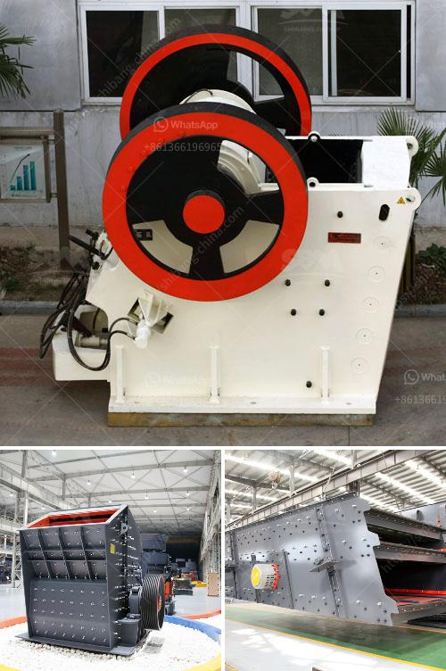

<h3>how much does it cost to rent a stone crusher</h3>
When it comes to hiring a stone crusher, cost can vary greatly depending on the specifications and the size of the machine. Most stone crushers are rented out on a monthly basis with a certain amount of hours of usage per day. The quality of the machine and the level of maintenance necessary can also impact the rental price. 

The basic cost of renting a stone crusher is usually around $250 per hour, which includes 4 hours of usage. However, this cost is dependent on the duration of your rental and the amount of material you need to crush. For larger projects, some companies offer packages that include a set number of hours per month at a lower rate. 

Apart from the rental fee, there may be additional costs involved in renting a stone crusher. These costs can include fuel, transportation, and any necessary permits or licenses. It is always a good idea to discuss these additional costs with the rental company beforehand to avoid any unexpected expenses. 

In addition to the rental cost, you should also consider the cost of transporting the stone crusher to and from your worksite. Some rental companies offer delivery services for an additional fee, while others may require you to arrange transportation on your own. This cost will vary depending on the distance and the equipment required for transportation. 

Lastly, it is important to factor in the cost of any necessary maintenance or repairs. While rental companies typically take care of regular servicing, any damages caused by misuse or negligence may be charged separately. It is advisable to read through the rental agreement carefully to understand the terms and conditions regarding maintenance and repairs. 

In conclusion, the cost of renting a stone crusher can range from around $250 per hour to several thousand dollars depending on various factors such as the size of the machine, duration of rental, and additional costs. It is essential to thoroughly research and compare different rental companies to find the best deal that suits your specific needs and budget.
<h3>Contact us</h3><ul><li><strong>Whatsapp:&nbsp;<a href="https://wa.me/8613661969651">+8613661969651</a></strong></li><li><a href="https://swt.shibang-china.com/?git&amp;zhl&amp;how much does it cost to rent a stone crusher"><strong>Online Service(chat now)</strong></a></li></ul><h3>Related</h3><ul><li><a href='gold ore processing nigeria.md'>gold ore processing nigeria</a></li><li><a href='jaw crusher manufactures in saudi.md'>jaw crusher manufactures in saudi</a></li><li><a href='dry ball mill vs wet ball mill.md'>dry ball mill vs wet ball mill</a></li><li><a href='limestone crusher for sale.md'>limestone crusher for sale</a></li><li><a href='limestone crusher machine limus.md'>limestone crusher machine limus</a></li></ul>