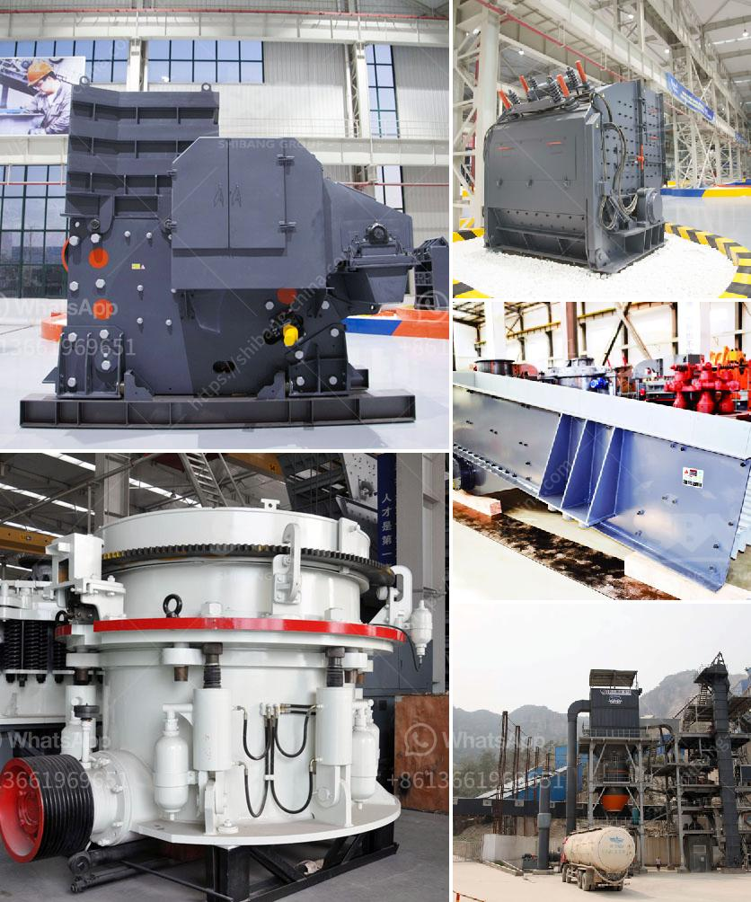

<h3>how much does it cost to set up a mini cement plant</h3>
Setting up a mini cement plant can be a cost-effective and efficient way to meet the growing demands for cement in your local market. In recent years, with the increasing development and urbanization, the demand for cement has risen exponentially. This has created an opportunity for individuals and entrepreneurs to invest in the cement industry.

The cost of setting up a mini cement plant varies from country to country. The flexibility of the machine design, manufacturing, and the supply chain also impact the overall cost. However, some general estimates can be made to give you an idea of the potential investment.

Firstly, you need to consider the land and site preparation costs. The plant requires enough space for stockpiling raw materials, storing finished products, and accommodating machinery and equipment. The cost of procuring suitable land will depend on its location, accessibility, and size.

Next, you need to consider the machinery and equipment required for the plant. The key machinery includes crushers, mills, kilns, conveyors, and cement silos. The cost of procuring these machines can vary based on their capacity, quality, and the manufacturer. It is advisable to research and compare different suppliers to get competitive prices.

Alongside machinery, you also need to invest in hiring skilled labor and professionals. This includes plant operators, maintenance workers, engineers, and managers. These personnel are crucial for the smooth functioning and success of the plant. The cost of labor will depend on the local market rates and labor regulations.

Raw materials such as limestone, clay, iron ore, and gypsum are required for cement production. The cost of procuring these materials may vary based on availability and transportation logistics. It is essential to establish reliable and cost-effective supply chains to ensure a consistent flow of raw materials to the plant.

In addition to the setup costs, you also need to consider the recurring operational costs. This includes electricity, fuel, maintenance, and transportation expenses. The specific costs will depend on the scale of operations, energy efficiency measures, and local prices.

To summarize, setting up a mini cement plant involves several factors that influence the cost. These include land and site preparation, machinery and equipment, skilled labor, raw materials, and recurring operational expenses. The initial investment can range from a few hundred thousand dollars to a few million dollars, depending on the scale of the plant and the local market conditions.

It is crucial to conduct a detailed feasibility study to assess the market potential, analyze the cost structure, and evaluate the profitability of the project. Consulting with industry experts, experienced engineers, and financial advisors can help you make informed decisions and optimize your investment.

While setting up a mini cement plant requires a significant upfront investment, it can yield attractive returns in the long run. With careful planning, efficient operations, and a strong focus on quality, a mini cement plant can become a successful and profitable venture.
<h3>Contact us</h3><ul><li><strong>Whatsapp:&nbsp;<a href="https://wa.me/8613661969651">+8613661969651</a></strong></li><li><a href="https://swt.shibang-china.com/?git&amp;zhl&amp;how much does it cost to set up a mini cement plant"><strong>Online Service(chat now)</strong></a></li></ul><h3>Related</h3><ul><li><a href='gold processing plant equipment price.md'>gold processing plant equipment price</a></li><li><a href='gold hammer mills for sale south africa.md'>gold hammer mills for sale south africa</a></li><li><a href='quarry machine price.md'>quarry machine price</a></li><li><a href='stone crusher machine size 100 x 100 cm.md'>stone crusher machine size 100 x 100 cm</a></li><li><a href='decibels generated by hebro jaw crusher.md'>decibels generated by hebro jaw crusher</a></li></ul>