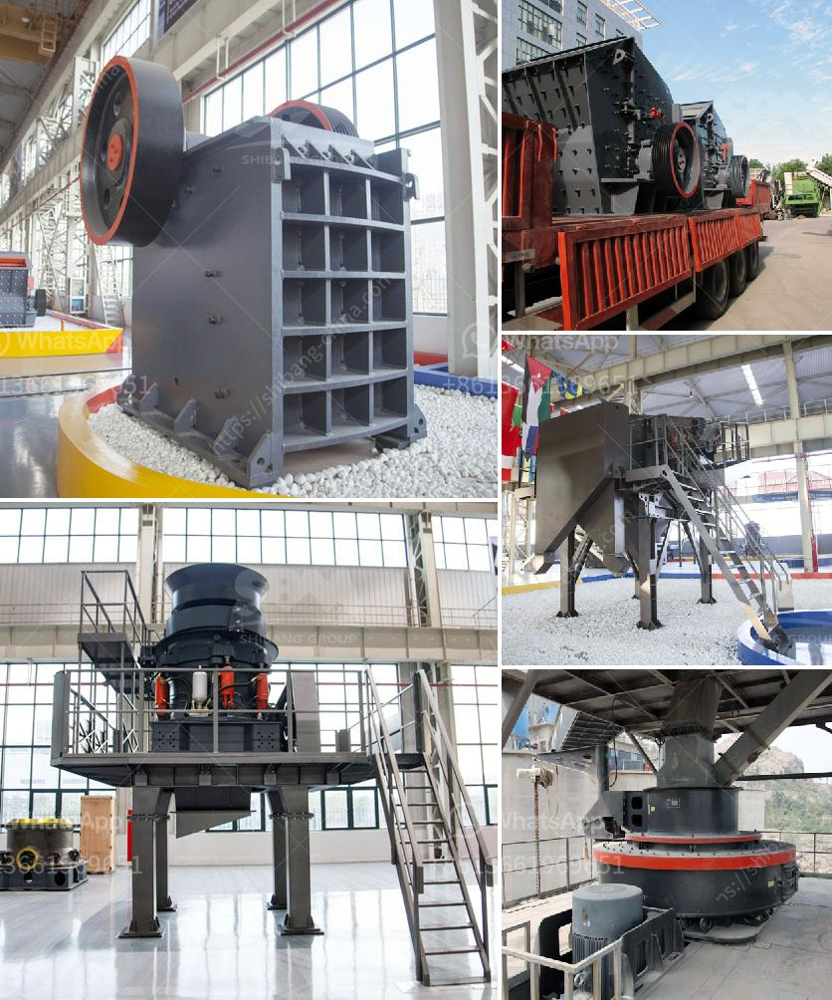

<h3>how much the price of grinder machine in philippines</h3>
Grinder machines have become an essential tool for a wide array of industries in the Philippines. Whether it's for household chores, commercial use, or industrial applications, these machines streamline the process of grinding, cutting, and polishing various materials. As with any piece of equipment, the price of grinder machines in the Philippines can vary significantly based on several factors. In this article, we will explore the price range of grinder machines available in the country, along with the factors that influence their costs.

In the Philippines, grinder machines are available in various price ranges to cater to different budgets and requirements. While the market offers machines at different price points, the average cost of a grinder machine typically falls in the range of PHP 5,000 to PHP 35,000. This price range usually includes both manual and electric grinders suitable for home use, small businesses, and light industrial applications.

The type of grinder machine plays a significant role in determining its price. There are various types available, such as angle grinders, bench grinders, die grinders, and more. Each type serves different purposes and comes with its unique features, power, and capabilities. Generally, more specialized and high-powered grinder machines tend to have higher price tags.

Grinder machines come in different power ratings, typically measured in watts (W) or horsepower (HP). Higher-powered machines are more efficient, providing faster grinding and cutting processes. As a result, they are often priced higher due to their enhanced performance and durability.

The reputation of the brand manufacturing the grinder machine also influences its pricing. Established and renowned brands often charge a premium for their products due to their quality, reliability, and after-sales support. However, there are also affordable grinder machines available from lesser-known brands that provide good value for money.

Additional features and functionalities, such as adjustable speeds, safety features, ergonomic designs, and multiple attachments, may impact the price of a grinder machine. These added features enhance the versatility and usability of the machine, catering to specific needs, which can contribute to a higher price point.

Market dynamics, including demand and supply, can also influence the price of grinder machines. When demand is high and the supply is limited, prices tend to be higher. Conversely, during periods of low demand or increased competition, prices may relatively decrease.

Grinder machines play a crucial role in the Philippines, supporting a wide range of industries and applications. When considering purchasing a grinder machine, it is essential to understand the factors influencing their costs. From type and power to brand reputation, additional features, and market dynamics, various elements determine the price range of grinder machines in the Philippines. By carefully evaluating these factors, individuals and businesses can make informed decisions regarding the purchase of a grinder machine that best suits their needs and budget.
<h3>Contact us</h3><ul><li><strong>Whatsapp:&nbsp;<a href="https://wa.me/8613661969651">+8613661969651</a></strong></li><li><a href="https://swt.shibang-china.com/?git&amp;zhl&amp;how much the price of grinder machine in philippines"><strong>Online Service(chat now)</strong></a></li></ul><h3>Related</h3><ul><li><a href='vibratory screen manufacturer in europe.md'>vibratory screen manufacturer in europe</a></li><li><a href='silica sand washing and grinding.md'>silica sand washing and grinding</a></li><li><a href='belt conveyor for sale china.md'>belt conveyor for sale china</a></li><li><a href='grinding mill material.md'>grinding mill material</a></li><li><a href='mobile jaw crusher for sale.md'>mobile jaw crusher for sale</a></li></ul>