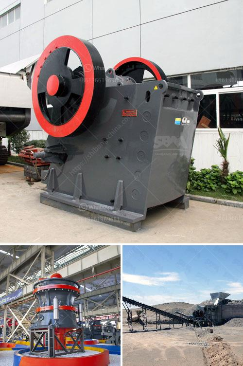

<h3>how profitable is tipping truck business in nigeria</h3>
The tipping truck business in Nigeria has proven to be a profitable venture for many entrepreneurs. With the rapid growth of the construction and mining industries, the demand for tipping trucks has significantly increased in the country. This surge in demand has created ample opportunities for individuals looking to invest in this line of business.

One of the key factors contributing to the profitability of the tipping truck business is the consistent need for transportation of raw materials, such as sand, gravel, and stones. These materials are essential in the construction of buildings, roads, and other infrastructure projects. Tipping trucks provide a convenient and efficient means of transporting these materials from one location to another, saving time and effort for construction companies.

Additionally, the mining industry heavily relies on tipping trucks for the transportation of mined materials, including coal, iron ore, and limestone. These minerals are essential in the production of various commodities, ranging from steel to cement. Consequently, the demand for tipping trucks from mining companies is consistently high, ensuring a steady stream of business for truck owners.

Another factor contributing to the profitability of the tipping truck business is the willingness of customers to pay a premium for reliable and efficient services. Construction and mining projects are time-sensitive, and any delays in material transportation can result in significant losses for the project owners. Therefore, truck owners who can consistently provide timely and reliable transportation services are highly valued and can command higher rates.

In conclusion, the tipping truck business in Nigeria is a profitable venture due to the growing construction and mining industries in the country. The demand for tipping trucks is consistently high, and customers are willing to pay a premium for reliable and efficient services. Entrepreneurs looking to invest in this business can expect to achieve significant returns on their investment in the long run.
<h3>Contact us</h3><ul><li><strong>Whatsapp:&nbsp;<a href="https://wa.me/8613661969651">+8613661969651</a></strong></li><li><a href="https://swt.shibang-china.com/?git&amp;zhl&amp;how profitable is tipping truck business in nigeria"><strong>Online Service(chat now)</strong></a></li></ul><h3>Related</h3><ul><li><a href='lippman jaw crusher for sale.md'>lippman jaw crusher for sale</a></li><li><a href='stone grinder machine for marble.md'>stone grinder machine for marble</a></li><li><a href='flowsheet for crushing plant.md'>flowsheet for crushing plant</a></li><li><a href='company manufactures the best ball mill.md'>company manufactures the best ball mill</a></li><li><a href='technical specification for ball mill.md'>technical specification for ball mill</a></li></ul>