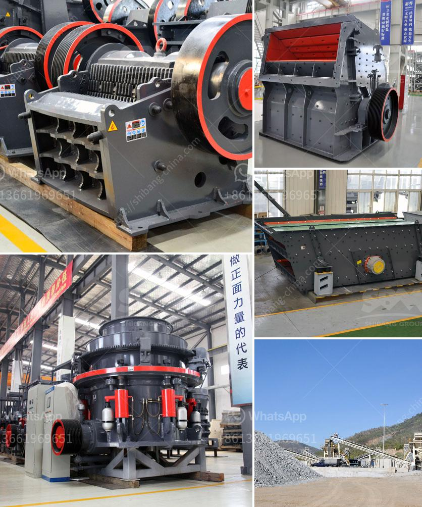

<h3>how to build a garnet wash plant</h3>
If you are in the gemstone or mining business and are looking to extract and process garnets efficiently, building a garnet wash plant can be an excellent investment. A wash plant specifically designed for garnet can help you achieve higher yields and improved quality. In this article, we will provide a step-by-step guide on how to build a garnet wash plant.

Before embarking on the construction of a garnet wash plant, it is essential to conduct thorough research. Understand the requirements, capacity, and specific characteristics of garnets. This knowledge will allow you to design an effective wash plant that caters to your needs and ensures optimal performance.

Selecting an appropriate site for the wash plant is crucial. Look for a location that offers easy accessibility for the transportation of raw materials and finished products. It should have ample space to accommodate the wash plant equipment, as well as proper drainage facilities to handle the waste water generated during the washing process.

The design of the wash plant plays a critical role in its efficiency and productivity. Determine the desired capacity of the plant, considering factors such as production demand and available resources. Include components such as a feeder, a scrubber, screens, and a garnet recovery system.

Source high-quality equipment required for the wash plant. Ensure that the supplier specializes in manufacturing machinery for garnet-specific processing. Collaborate with the supplier to ensure the selection of appropriate equipment that suits the plant's design and meets industry standards.

Begin the construction phase once the equipment is procured. Develop a detailed construction plan, considering factors such as logistics, safety measures, and timeframes. Install the components of the wash plant systematically, ensuring that each step is completed accurately and securely.

Once the installation is complete, conduct thorough testing of the wash plant before commencing full-scale production. Test each component individually and then test the system as a whole, making adjustments as needed. Fine-tune the wash plant to ensure efficiency, proper water flow, and effective garnet recovery.

To maximize the lifespan and functionality of the wash plant, establish a regular maintenance routine. Conduct periodic inspections, clean the equipment, and make necessary repairs or replacements as required. Install monitoring tools to track the performance of the wash plant in real-time.

Building a garnet wash plant requires careful planning, research, and implementation. By following the steps outlined in this article, you can construct an efficient and effective wash plant that meets your production demands. Remember, regular maintenance and monitoring are crucial to ensure long-term productivity and sustainability. With an optimally designed and well-maintained garnet wash plant, you can expect higher yields, improved quality, and increased success in the gemstone or mining industry.
<h3>Contact us</h3><ul><li><strong>Whatsapp:&nbsp;<a href="https://wa.me/8613661969651">+8613661969651</a></strong></li><li><a href="https://swt.shibang-china.com/?git&amp;zhl&amp;how to build a garnet wash plant"><strong>Online Service(chat now)</strong></a></li></ul><h3>Related</h3><ul><li><a href='how to calculate the cost of returns.md'>how to calculate the cost of returns</a></li><li><a href='copper ore crusher.md'>copper ore crusher</a></li><li><a href='technical specification for ball mill.md'>technical specification for ball mill</a></li><li><a href='crusher plant in kenya.md'>crusher plant in kenya</a></li><li><a href='mobile chrome crusher suppliers in south africa.md'>mobile chrome crusher suppliers in south africa</a></li></ul>