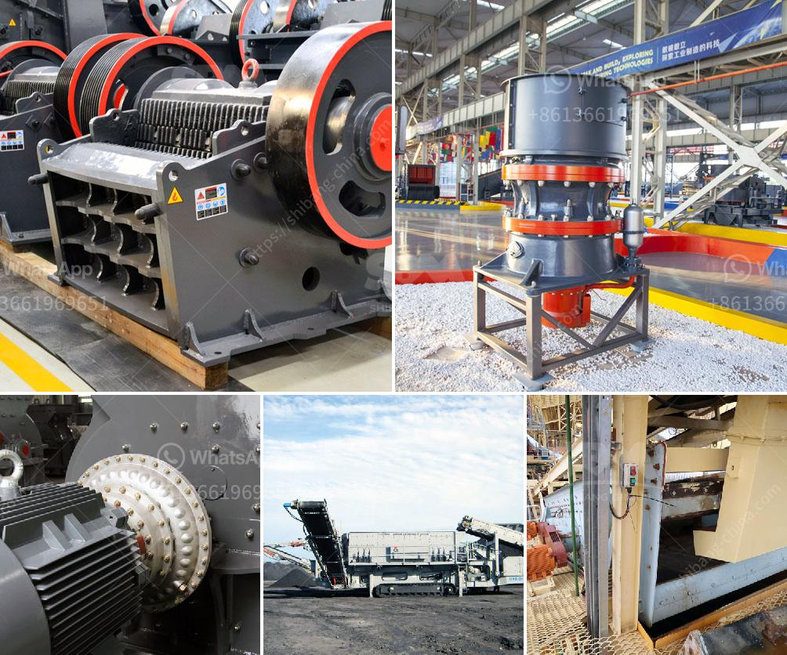

<h3>how to calculate the cost of returns</h3>
Returns are an inherent part of any business, regardless of its size or industry. While it may seem like a straightforward process, accurately calculating the cost of returns is essential for understanding the impact they have on profitability and making informed decisions.

To calculate the cost of returns, businesses must consider various factors. First and foremost, there is the cost of the returned product itself. In some cases, the item might be resalable, but often it requires refurbishing or repackaging before it can be reintroduced into inventory. These additional costs must be factored in when calculating the total cost.

Beyond the direct expenses related to the returned product, businesses must also take into account associated costs. For instance, there are transportation costs incurred when both shipping the item to the customer and when the customer returns it. These expenses typically include packaging supplies, labor, and shipping fees from carriers, which can be significant.

Moreover, there are administrative and support costs involved. These include customer service time spent handling return requests, processing refunds or replacements, and updating inventory systems. Businesses should also consider any additional marketing or promotional expenses to regain customer trust and loyalty, such as providing discounts or coupons to customers who had a negative experience with a return.

Furthermore, the loss of potential revenue from returns must be factored in. Once an item is returned, it cannot be sold at its original price. This is particularly true for products that have a limited shelf life or those that quickly become obsolete due to technological advancements. Therefore, the opportunity cost of returns should be considered while calculating their total cost.

In conclusion, calculating the cost of returns is a complex task that involves more than simply considering the price of the returned product. By taking into account the direct costs, associated expenses, administrative and support costs, and lost revenue opportunities, businesses can gain a comprehensive understanding of the true impact of returns on their bottom line. Armed with this knowledge, businesses can make strategic decisions to minimize returns, improve customer satisfaction, and ultimately, enhance overall profitability.
<h3>Contact us</h3><ul><li><strong>Whatsapp:&nbsp;<a href="https://wa.me/8613661969651">+8613661969651</a></strong></li><li><a href="https://swt.shibang-china.com/?git&amp;zhl&amp;how to calculate the cost of returns"><strong>Online Service(chat now)</strong></a></li></ul><h3>Related</h3><ul><li><a href='quartz stone crushing unit in india.md'>quartz stone crushing unit in india</a></li><li><a href='ball mill micron.md'>ball mill micron</a></li><li><a href='ball mill working in hindi.md'>ball mill working in hindi</a></li><li><a href='wet grinding mill china.md'>wet grinding mill china</a></li><li><a href='crushers manufacturer turkey.md'>crushers manufacturer turkey</a></li></ul>