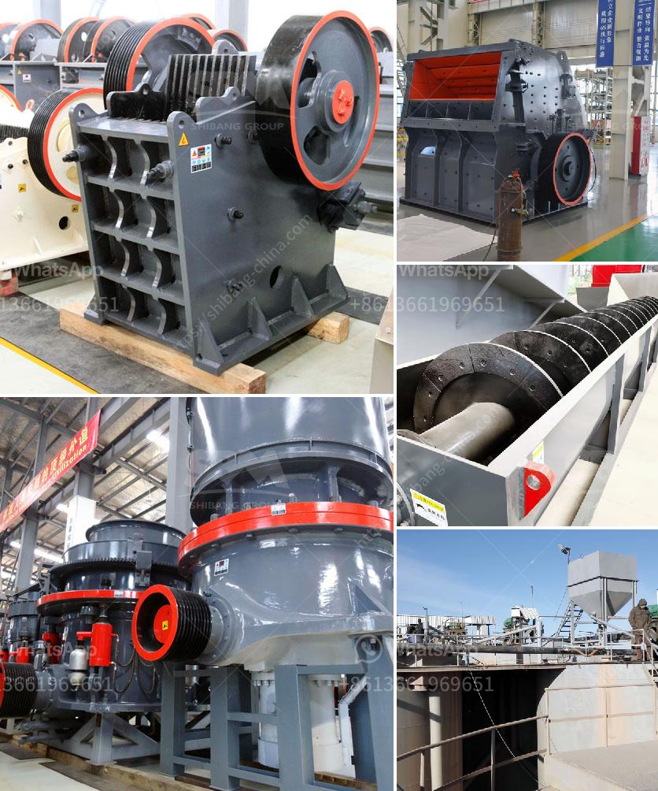

<h3>how to decrease the dust in a crushing plant</h3>
Crushing plants play a vital role in various industrial sectors, such as mining, construction, and aggregate production. However, one common challenge faced by operators is the generation and dispersion of dust particles during the crushing process. Excessive dust can lead to several health hazards, environmental issues, and operational inefficiencies. This article aims to provide some effective strategies to help decrease dust levels within a crushing plant.

Investing in a comprehensive dust suppression system is essential to decrease dust production in a crushing plant. These systems utilize water sprays or chemical agents to bind dust particles, preventing their dispersion. Regular maintenance and evaluation of such systems are crucial to ensure optimal performance.

Dust generation often occurs due to the mishandling of materials within a crushing plant. Employing proper material handling techniques, such as using enclosed conveyors, chutes, and hoppers, minimizes the chances of dust release. Conveyor belt skirting can also effectively prevent dust from escaping during transportation.

Enclosing the crushing areas can significantly reduce dust emissions. Erecting barriers or installing enclosures made of thick plastic, fabric, or other dust-retaining materials creates a controlled environment, minimizing dust dispersion. Additionally, these enclosures also provide noise reduction benefits, making it a win-win solution.

Proper cleaning and maintenance practices are imperative for dust reduction in a crushing plant. Regularly clean equipment, surfaces, and inspection areas to prevent the buildup of fine particles that can be dispersed into the air. Ensure effective dust collection systems are installed, and filters are cleaned or replaced frequently.

Efficient ventilation systems help control and redirect airborne dust particles. This can be achieved by installing well-designed ventilation systems that capture and redirect dust away from workers and equipment. Utilize negative or positive pressure systems depending on the specific requirements of the crushing plant setup.

Dust control in a crushing plant is essential for the health and safety of workers, as well as environmental protection. By implementing effective solutions such as dust suppression systems, optimizing material handling, enclosing crushing areas, practicing regular cleaning and maintenance, and ensuring proper ventilation, operators can significantly reduce dust levels. These strategies not only mitigate health risks but also enhance operational efficiency and comply with environmental regulations.
<h3>Contact us</h3><ul><li><strong>Whatsapp:&nbsp;<a href="https://wa.me/8613661969651">+8613661969651</a></strong></li><li><a href="https://swt.shibang-china.com/?git&amp;zhl&amp;how to decrease the dust in a crushing plant"><strong>Online Service(chat now)</strong></a></li></ul><h3>Related</h3><ul><li><a href='ball mill screen 200 tph.md'>ball mill screen 200 tph</a></li><li><a href='industrial mills for coal.md'>industrial mills for coal</a></li><li><a href='difference between pebble and stone.md'>difference between pebble and stone</a></li><li><a href='ball mill grinder.md'>ball mill grinder</a></li><li><a href='mobile coal jaw crusher for hire.md'>mobile coal jaw crusher for hire</a></li></ul>